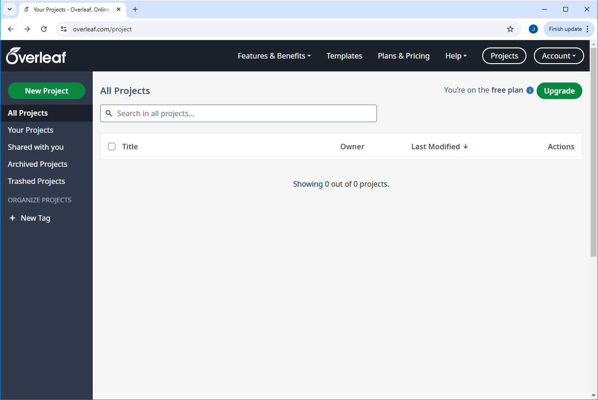

:::::::::::::::::::::::::::::::::::::: questions

- How can I write and render a LaTeX document?
- How can I use Overleaf to write and render a LaTeX document?

::::::::::::::::::::::::::::::::::::::::::::::::

::::::::::::::::::::::::::::::::::::: objectives

- Demonstrate how to create a new project in Overleaf.
- Become familiar with the Overleaf interface.

::::::::::::::::::::::::::::::::::::::::::::::::

## What is LaTeX

LaTeX is a typesetting language, useful for combining text with mathematical equations, figures,
tables, and citations, among other things.

Unlike common word processors like Microsoft Word or LibreOffice Writer, LaTex is a *markup
language*, meaning that formatting (including bold text, bullet points, and changes in font size)
is indicated by the use of commands, special characters, or *environments*.

In order to produce the actual document, this mark-up text must be *compiled*. Errors in the
mark-up can either be non-fatal, meaning the document will compile with some warnings; or fatal,
meaning the document will fail to compile.

## Our first Overleaf Project

There are several ways to write LaTeX documents, but we'll be using Overleaf, a cloud-based LaTeX
editor. This has the advantage of being accessible from any computer with an internet connection,
without the need to install any additional software. As part of the preparation for this workshop,
you should have registered for an account on Overleaf.

We'll start by creating a new, 'Blank', project in Overleaf by clicking on the large green button
that says 'New Project' in the top left corner of the screen. This will open a drop-down menu with
a number of options. We'll select 'Blank Project' from this menu. Name the project 'LaTeX Workshop'
and click 'Create'.

{alt='The Overleaf main page.'}

## The Overleaf Interface
Once the project is created, you'll see that it isn't quite blank. There are four main panels when
you open a new project in Overleaf:

- 1. The *File Navigator* on the top left, which shows all of the files in your project.
- 2. The *File Outline* on the bottom left, which shows the structure of the current file.
- 3. The *Text Editor* in the middle, where you can write your LaTeX code.
- 4. The *Preview Pane* on the right, which shows a preview of the compiled document.

{alt='The Overleaf interface.'}

You'll notice that our project isn't quite blank, as we have a file called `main.tex` open in the
text editor with some LaTeX code already written. This is a basic LaTeX document, with some of the
minimum requirements for a LaTeX document.

## The Main Menu

When we want to switch projects or create a new one, we can use the main menu at the top of the
screen, which is indicated by a small "house" icon. Clicking on this icon will take us back to the
main landing page for overleaf, where we initially created our project.

We can see now in the section "All Projects" that our new project, "LaTeX Workshop", is listed
there, that we are the owner, and that it was just recently modified. We can click on the project
name to open it again.

:::::::::::::::::::::::::::::::::::::::::::::::::::::::::::::::::::: instructor

Inline instructor notes can help inform instructors of timing challenges
associated with the lessons. They appear in the "Instructor View"

::::::::::::::::::::::::::::::::::::::::::::::::::::::::::::::::::::::::::::::::

::::::::::::::::::::::::::::::::::::: challenge

## Challenge 1: Create a new project, then delete it

See if you can create a new project in Overleaf. Name it "A test project". Then close the project
and reopen the "LaTeX Workshop" project. Finally, delete the "A test project" project.

:::::::::::::::::::::::: solution

## Answer

Creating a new project:

- Click the "house" icon on the top menu bar to return to the main Overleaf page.
- Click the "New Project" button.
- Select "Blank Project" from the drop-down menu.
- Enter in "A test project" as the project name.
- Click "Create".

Closing and reopening the "LaTeX Workshop" project:
- Click the "house" icon on the top menu bar to return to the main Overleaf page.
- Click on the "LaTeX Workshop" project to reopen it.

Deleting the "A test project" project:
- Click the "house" icon on the top menu bar to return to the main Overleaf page.
- Click the "trash can" icon next to the "A test project" project.
- Confirm that you want to delete the project.

:::::::::::::::::::::::::::::::::
::::::::::::::::::::::::::::::::::::::::::::::::

::::::::::::::::::::::::::::::::::::: keypoints

- We can use Overleaf to edit and render LaTeX documents.
- An Overleaf project can contain many files.

::::::::::::::::::::::::::::::::::::::::::::::::

