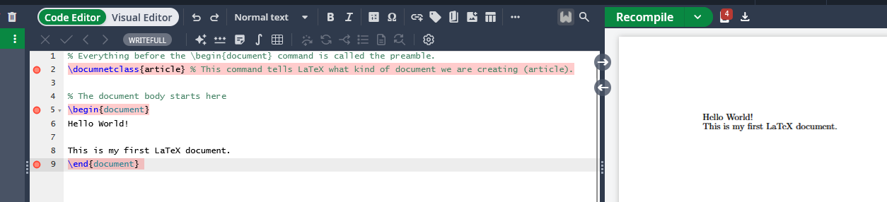
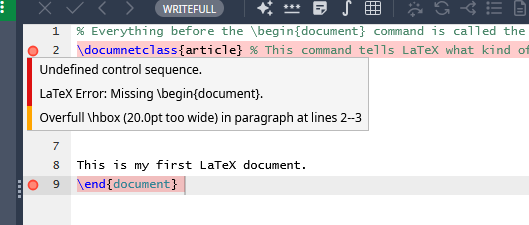

:::::::::::::::::::::::::::::::::::::: questions

- What is the basic structure of a LaTeX document?
- How do I see what my LaTeX document looks like when it's rendered?

::::::::::::::::::::::::::::::::::::::::::::::::

::::::::::::::::::::::::::::::::::::: objectives

- Become familiar with the basic structure of a LaTeX document.
- Use Overleaf to render a LaTeX document into a PDF.
- Identify how to add special characters to a LaTeX document.

::::::::::::::::::::::::::::::::::::::::::::::::

## Editing the Document
We can edit the `main.tex` file by clicking on it in the *File Navigator*. This will open the file
in the text editor. Let's edit some of the provided code to create our first LaTeX document.


```latex
\documentclass{article}

\begin{document}
Hello World!

This is my first LaTeX document.
\end{document}
```

::: callout

Errors happen! Check that you have entered each line in the text file exactly as written above.
Sometimes seemingly small input changes give large changes in the result, including causing a
document to not work. If you are stuck, try erasing the document and copying it fresh from the
lines above.

:::

## Looking at our document

Our first document shows us the basics. LaTeX documents are a mixture of text and commands.

- *Commands* start with a backslash `\` and sometimes have arguments in curly braces `{}`.
- *Text* is what you want to appear in the document and requires no special formatting.

Let's look at the commands we've used so far:

- `\documentclass{article}`: This command tells LaTeX what kind of document we are creating. (We
  might also use this command to instruct LaTeX to use a specific font size, paper size, or other
  document settings.)
- `\begin{document}` and `\end{document}`: These commands mark the beginning and end of the
  document body. These commands are required in every LaTeX document and create the document body.

::: callout

You can have multiple \begin{...} and \end{...} pairs in a single LaTeX document, but
you must have exactly as many \begin{...} commands as \end{...} commands.

:::

Everything before the `\begin{document}` command is called the *preamble*. The preamble is where
you set up the document, including the document class, title, author, and any other settings you
want to apply to the entire document.

### Comments

We can add comments to our document by using the `%` character. Anything after the `%` on a line is
ignored by LaTeX. As in any other programming language, comments are useful for explaining what the
code is doing. We'll start incorporating comments into our document going forward to explain some 
of the specifics of the LaTeX code we're writing. 

As we go, you should use your version of the document to add your own comments as a way of taking 
notes on what you're learning, and to act as a reference for yourself in the future!

```latex
% This command tells LaTeX what kind of document we are creating (article).
\documentclass{article} 


% Everything before the \begin{document} command is called the preamble.
\begin{document} % The document body starts here
Hello World!

This is my first LaTeX document.
\end{document} 
```

Going forward, the examples we provide will not always include comments, but you should add them 
to your document as you see fit.

## Rendering the Document

In your Overleaf project, click the green *Recompile* button to render the document. This will
generate a preview of the document in the right-hand pane.

::: callout

There are many shortcut keyboard commands that you can use to speed up your work in Overleaf. When
we want to render the document, we can use `Ctrl + S` or `Ctrl + Enter` (Windows) or `Cmd + S` or
`Cmd + Enter` (Mac). This will save the document and render it in one step.

:::

### Errors, Warnings and the Log

Inevitably, everyone makes mistakes when writing LaTeX documents. When you recompile your document,
you might not see any changes in the preview pane. This could be because there is an error in your
document. If there is an error, you will see a red number next to  the "Recompile" button over the 
"Logs and output files" button. You will also see certain lines highlighted in red in the text
editor, along with a suggestion of what the error might be.

Let's introduce an error into our project to see what this might look like. Let's introduce a typo
into the `documentclass` command by changing it to `documnetclass`. When we recompile the document,
we can see our errors:

{alt='Error in the LaTeX document.'}

And if we click on the "Logs and output files" button, we can see a more detailed error message:

{alt='Error message in the LaTeX document.'}

We can see similar messages when hovering over the small red circle next to the error in the text
editor:

{alt='Error message on Hover.'}

### Fixing Errors

Our tiny typo seems to have caused quite a number of issues! This can happen, the important thing 
is to read the error message and try to understand what it's telling you. In this case it says:

```
Undefined control sequence. ./main.tex, 2

The compiler is having trouble understanding a command you have used. Check that the command is 
spelled correctly. If the command is part of a package, make sure you have included the package 
in your preamble using \usepackage{...}.
```

In order to diagnose the issue, we can first look at the name of the message. In this case, it's
`Undefined control sequence`. This means that LaTeX doesn't recognize the command we've used.
Specifically, it says, this undefined sequence is on line 2 of the `main.tex` file. We can then
look at the line and see that we've made a typo in the `\documentclass` command.

As soon as we fix this typo and recompile our document, we should see the preview pane update and
all of the remaining errors disappear.

::: callout

The subsequent errors, talking about "missing begin document", and "font size command not defined"
are all cascading errors from the initial error. When LaTeX encounters an error, it can't continue
to compile the document, so it stops and reports the error it found. This can sometimes lead to
multiple error messages, but generally it's important to fix the first error first, as this will
often resolve subsequent errors.

:::

## Paragraphs

Note that we have an empty line between our two lines of text. This is important in LaTeX, as this
indicates a new paragraph. Let's try removing the empty line and recompiling the document to see
what happens.

You should see that the two lines of text are now displayed on the same line. This is because LaTeX
treats the two lines as part of the same paragraph. If you want to start a new paragraph, you need
to leave a blank line between the two paragraphs.

## Special Characters

You've probably noticed by now that the characters `\`, `{`, and `}` are special characters in
LaTeX. There are others though, such as `$`, `%`, `&`, `#` and `^`. These characters tend to be
much less common in text, but you can use them by "escaping" them with a backslash. For example,

- `\%` produces `%`
- `\&` produces `&`
- `\#` produces `#`
- `\^` produces `^`

and so on.

::::::::::::::::::::::::::::::::::::: challenge

## Challenge 1: What's wrong with this document?

There is an error in the following LaTeX document. Can you find it?

```latex
\documentclass{article}

\title{My First LaTeX Document}

I've created a new LaTeX document.

But there's an issue with it that's preventing it from rendering correctly.

Can you find and fix the error?

\end{document}
```

:::::::::::::::::::::::: solution

## Answer

Each section of a LaTeX document must be enclosed in a pair of `\begin{...}` and `\end{...}`. This
document is missing the `\begin{document}` command.

:::::::::::::::::::::::::::::::::
::::::::::::::::::::::::::::::::::::::::::::::::


::::::::::::::::::::::::::::::::::::: challenge

## Challenge 2: Displaying Special characters.

How would I display the following text in a LaTeX document?

```
5 is greater than 3 & 2 is less than 4. This is 100% true.
```

:::::::::::::::::::::::: solution

## Answer

We need to use escapes before each of the special characters. The following LaTeX code will display
the text correctly:

```latex
5 is greater than 3 \& 2 is less than 4. This is 100\% true.
```

:::::::::::::::::::::::::::::::::
::::::::::::::::::::::::::::::::::::::::::::::::


::::::::::::::::::::::::::::::::::::: keypoints

- We can use Overleaf to edit and render LaTeX documents.
- LaTeX documents are a mixture of text and commands.
- Commands start with a backslash `\` and sometimes have arguments in curly braces `{}`.

::::::::::::::::::::::::::::::::::::::::::::::::

::: spoiler

After this episode, here is what our LaTeX document looks like:

```latex
% This command tells LaTeX what kind of document we are creating (article).
\documentclass{article} 


% Everything before the \begin{document} command is called the preamble.
\begin{document} % The document body starts here
Hello World!

This is my first LaTeX document.
\end{document} 
```

:::
