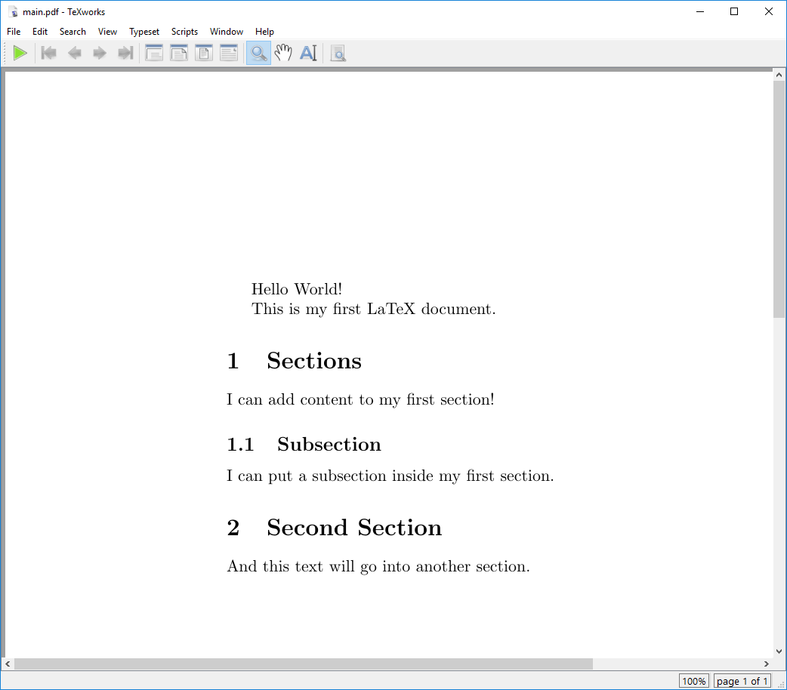
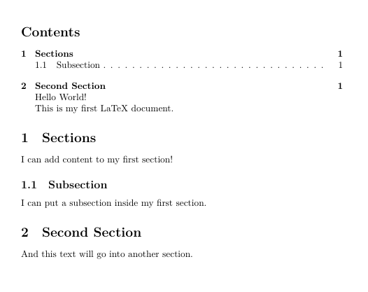

:::::::::::::::::::::::::::::::::::::: questions

- How are LaTeX documents structured?

::::::::::::::::::::::::::::::::::::::::::::::::

::::::::::::::::::::::::::::::::::::: objectives

- Identify the different kinds of section commands in LaTeX.


::::::::::::::::::::::::::::::::::::::::::::::::

## Sections

In a word processor, you might use headings to organize your document.In LaTeX, we'll use the
section commands:

- `\section{...}`
- `\subsection{...}`

LaTeX will handle all of the numbering, formatting, vertical spacing, fonts, and so on in order to
keep these elements consistent throughout your document. Let's add sections to our document.

```latex
% This command tells LaTeX what kind of document we are creating (article).
\documentclass{article}


% Everything before the \begin{document} command is called the preamble.
\begin{document} % The document body starts here

% The section command automatically numbers and formats the section heading.
\section{Sections}

Hello World!

This is my first LaTeX document.

I can add content to my first section!

% The subsection command does the same thing, but for sections within sections.
\subsection{Subsection}

I can put a subsection inside my first section.

\section{Second Section}

And this text will go into another section.

\end{document}
```

You should have something that looks like this:

{alt='Our document with sections added.'}

::: callout

There are many different section commands in LaTeX, including `\subsubsection{...}`,
`\paragraph{...}`, `\chapter{...}`, and more. Each of these commands will create a new section
heading with a different level of indentation and numbering.

Some of these commands are only available in certain document classes, so be sure to check the
documentation for the class you are using.

:::

::: callout

There's also an alternative way to create sections in LaTeX using the `\section*{...}` command.
This command will create a section heading without numbering it. This can be useful for creating
unnumbered sections, such as an introduction or conclusion.

:::

## Table of Contents

We've seen how to make sections and how LaTeX will automatically number them for us. But we can
also use this feature to automatically generate a table of contents for our document! We can do
this by adding the `\tableofcontents` command to our document body. This will create a table of
contents at the location where the command is placed.

```latex
% This command tells LaTeX what kind of document we are creating (article).
\documentclass{article}


% Everything before the \begin{document} command is called the preamble.
\begin{document} % The document body starts here

\tableofcontents

% The section command automatically numbers and formats the section heading.
\section{Sections}

Hello World!

This is my first LaTeX document.

I can add content to my first section!

% The subsection command does the same thing, but for sections within sections.
\subsection{Subsection}

I can put a subsection inside my first section.

\section{Second Section}

And this text will go into another section.

\end{document}
```

{alt='Our document with a table of contents.'}


## Challenges

::::::::::::::::::::::::::::::::::::: challenge

## Challenge 1:


:::::::::::::::: solution


:::::::::::::::::::::::::
:::::::::::::::::::::::::::::::::::::::::::::::

::::::::::::::::::::::::::::::::::::: keypoints

- LaTeX documents are structured using section commands.
- There are many different section commands in LaTeX, including `\subsubsection{...}`, `\paragraph{...}`, `\chapter{...}`, and more.

::::::::::::::::::::::::::::::::::::::::::::::::


::: spoiler

After this episode, [here is what our LaTeX document looks like](files/document_state/ep-03.tex).

:::
