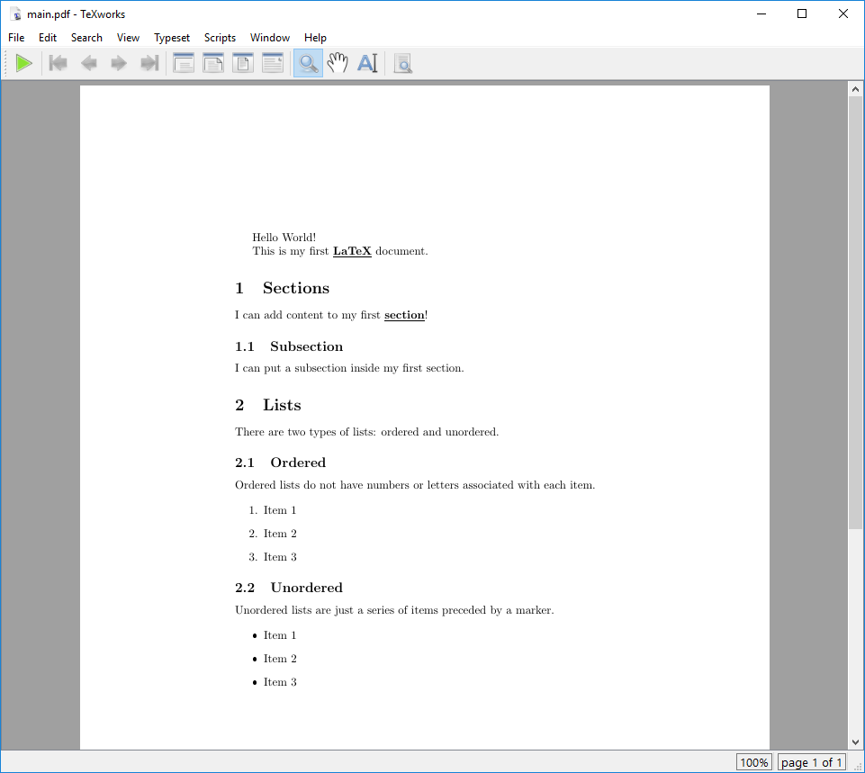
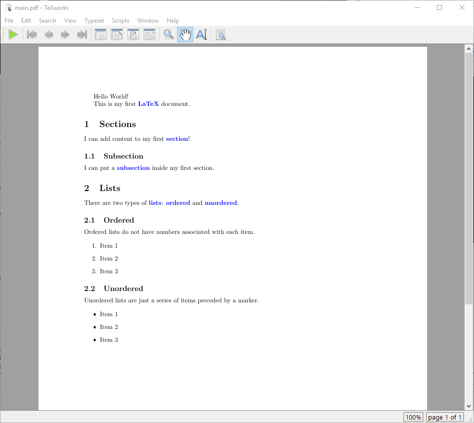

:::::::::::::::::::::::::::::::::::::: questions

- How can I extend LaTeX to suit my needs?
- How can I define my own commands in LaTeX?

::::::::::::::::::::::::::::::::::::::::::::::::

::::::::::::::::::::::::::::::::::::: objectives

- Demonstrate how to extend LaTeX using packages.
- Add custom commands to a LaTeX document.

::::::::::::::::::::::::::::::::::::::::::::::::

## Adding Packages

After we've declared a class, we can use the preamble section of our document to add one or more
packages in order to extend LaTeX's functionality. Packages are collections of commands and
environments that add new features to LaTeX, for example:

- Changing how some parts of LaTeX work.
- Adding new commands.
- Changing the appearance/design of the document.

We can add a package to our document by using the `\usepackage` command in the preamble of our
document. For example, to add the `geometry` package to our document, we would add the following
line to the preamble:

```latex
\usepackage{geometry}
```

In addition to the name of the package in the curly braces, we can also add options to the package
by adding them in square brackets before the package name. For example, to set the width of the
text block in our document to 6cm, we would update this line to look like this:

```latex
\usepackage[width = 6cm]{geometry}
```

Give this a try in our `main.tex` document to see what happens. When you render the document, you
should see something like this:

{alt='A document with a narrow text block.'}

However this isn't what we really want, so we'll remove this line from our document.

## Changing the Design

It's useful to be able to adjust some aspects of the design independent of the document class, for
example, the page margins. We used the `geometry` package in our previous example to set the width
of the text block, but now let's use it to specifically set the margins of our document:

::: callout

So far we've been showing the entire document in the examples. Going forward, we'll only show the
relevant sections of the document that we're discussing, so keep in mind when we are talking about
"adding this to the preamble" we mean adding it to the section of the document *before* the
`\begin{document}` command.

:::

Let's add this to the preamble of our document:

```latex
\usepackage[margin=1in]{geometry}
```

You should see that adding this package and setting the "margin" option to `1in` has shrunk the
margins of the document (try commenting out the `\usepackage` line with a `%` and recompiling to
see the difference).

## Defining Custom Commands

Using other people's packages is great, but what if there is some kind of functionality we want to
add to our document that isn't covered by a package? Or some specific formatting we want to use
repeatedly? We can define our own commands in LaTeX using the `\newcommand` command.

The `\newcommand` syntax looks like this:

```latex
\newcommand{\commandname}[number of arguments]{definition}
```

::: callout

We could be even more flexible by using an *optional* argument in our `\newcommand`.
Then the general structure of the command looks like this

```latex
\newcommand{\commandname}[number of arguments][default value for the first argument]{definition}
```

You can learn more about optional arguments in the last challenge of this episode.

:::


As an example, let's define a command that will highlight specific works in a document, so that
they appear italicised and underlined. We *could* do this by writing `\textbf{\underline{word}}`
around each word we want to highlight:

```latex
This is my first \textbf{\underline{LaTeX}} document.

\section{Sections}

I can add content to my first \textbf{\underline{section}}!
```

We can add this to each of our important terms in our document - maybe it looks something like this:

{alt='Our document with keywords highlighted
in bold and underlined.'}


In a long document this would quickly become tedious. Instead, let's define a new command called
`\kw` in the preamble of our document that will do this for us:

```latex
% The \newcommand defines a new custom command
% Highlight Keywords using the \kw{} command
\newcommand{\kw}[1]{\textbf{\underline{#1}}}
```

Now we can use the `\kw` command to highlight words in our document:

```latex
This is my first \kw{LaTeX} document.

\section{Sections}

I can add content to my first \kw{section}!
```

::: callout

Let's take a minute to go through and add the `\kw` command to all the keywords in our document.

- LaTeX
- section
- subsection
- lists
- ordered
- unordered

:::

::: spoiler

Related to the `\newcommand` command, we can also use the `\renewcommand` command to change the
definition of an existing command. This is useful, for example, if we want to change the
effect of a command partway through a document, or if we want to change the definition of a
command that is already defined in a package. It has an identical syntax to the `\newcommand`
command:

```latex
\renewcommand{\commandname}[number of arguments]{definition}
```

:::

### Code Reuse

This also means that we can easily change the formatting of all the words we've highlighted by
updating the definition of the `\kw` command. Let's say we wanted to change the formatting to bold
and change the color to blue:

::: callout

Standard LaTeX does not have a built-in way to change the color of text, but we can use the
`xcolor` package to do this by adding the `\usepackage{xcolor}` line to the preamble of our
document:

```latex
\usepackage{xcolor}
```

:::

Let's replace our `\kw` command with this new definition:
`\newcommand{\kw}[1]{\textcolor{blue}{\textbf{#1}}}`

When we recompile the document we should see that the formatting of our keywords has changed all at
once:

{alt='Our document with keywords highlighted in
blue.'}

::: callout

If the `xcolor` package is not installed, you can install it using your LaTeX package manager. For
Tex Live, you can use the `tlmgr` command to install the package:

```bash
tlmgr update --self --all # Optional: update all packages
tlmgr install xcolor
```

:::

## Defining Multiple Commands

We can define as many commands as we like in the preamble of our document. Let's add another one
that we can use to highlight commands in the document:

```latex
% Italicise LaTeX commands
\newcommand{\cmd}[1]{\textit{#1}}
```

We'll use this command in later sections.

## Challenges

::::::::::::::::::::::::::::::::::::: challenge

## Challenge 1: Importing a new package

A useful package to preview what your document will look like before your write a lot of text is
the `lipsum` package. This package provides sample text blocks from a common placeholder text.

How would you add the lipsum package to the preamble of your document?

:::::::::::::::::::::::: solution

## Answer

Add the line `\usepackage{lipsum}` to the preamble of your document.

You can then use the `\lipsum` command in the body of your document to add some dummy text.

:::::::::::::::::::::::::::::::::

::::::::::::::::::::::::::::::::::::::::::::::::

::::::::::::::::::::::::::::::::::::: challenge

## Challenge 2: What does this mean?

The definition of a new command in LaTeX is done with the `\newcommand` command. The syntax for this
command is:

```latex
\newcommand{\commandname}[number of arguments]{definition}
```

So if we modify the `\kw` command we defined above to look like this:

```latex
\newcommand{\kw}[2]{\textcolor{#1}{\textbf{#2}}}
```

What would the new `\kw` command do? and how would we use it?

:::::::::::::::::::::::: solution

## Output

The new `\kw` command would take two arguments: the first argument would be the color we want to
use to highlight the word, and the second argument would be the word we want to highlight. We would
use it like this:

```latex
\kw{red}{my keyword}
```


:::::::::::::::::::::::::::::::::

::::::::::::::::::::::::::::::::::::::::::::::::

::::::::::::::::::::::::::::::::::::: challenge

## Challenge 3: Can you write your own command with two arguments?

Suppose you want to define a new command that takes as input two words as arguments.
This first word shall be written **bold** while the second word shall be written *italic*.
Moreover, the first and the second word are separated by a comma followed by a whitespace.

Use `\newcommand` to define this command that takes two arguments as inputs and name it `\bo_it`.
Write the following sentence into your LaTeX document using your new command `\bo_it`:

This newly defined command highlights these two words: **Apple**, *Banana*.


:::::::::::::::::::::::: solution

## Output

The new `\boit` command would take two arguments: the first argument would be used with
`\tetxbf{#1}` to make the first word appear **bold**, and the second argument would be used with
`\tetxit{#2}` to make the first word appear *italic*.
Between `\tetxbf{#1}` and `\tetxit{#2}`, we would write `, ` to separate both words.
We would use the new command like this:

```latex
\documentclass{article}

\newcommand{\boit}[2]{\textbf{#1}, \textit{#2}}

\begin{document}

This newly defined command highlights these two words: \boit{Apple}{Banana}.

\end{document}
```


:::::::::::::::::::::::::::::::::

::::::::::::::::::::::::::::::::::::::::::::::::

::::::::::::::::::::::::::::::::::::: challenge

## Challenge 4: Optional arguments

New commands can be made even more flexible by defining commands that take an optional argument.
Then the general LaTeX code for this looks like this:

```latex
\newcommand{\commandname}[number of arguments][default value for the first argument]{definition}
```

The optional argument can be accessed and changed by writing square brackets `[]` directly after
the `\commandname` in the body of your document.

Consider the following, modified example of our `\kw` from before where we now use an optional
argument.

```latex
\newcommand{\kw}[2][red]{\textcolor{#1}{\textbf{#2}}}
```

In your LaTeX file, use the new `\kw` command to write down the words "Banana" in yellow, "Apple"
in red, and "Blueberry" in blue. Each word should be written in a separate line.

:::::::::::::::::::::::: solution

## Output

We can exploit the optional argument in `\kw` to write down the given words very efficiently.
For the first word, we change the optional argument to "yellow".
For the second word, we stick with the default value of "red".
For the third word, we change the optional argument to "blue".

```latex
\documentclass{article}

\newcommand{\kw}[2][red]{\textcolor{#1}{\textbf{#2}}}

\begin{document}

\kw[yellow]{Banana}

\kw{Apple}

\kw[blue]{Blueberry}


\end{document}
```


:::::::::::::::::::::::::::::::::

::::::::::::::::::::::::::::::::::::::::::::::::

::::::::::::::::::::::::::::::::::::: keypoints

- We can extend LaTeX's functionality by adding packages to our document.
- We can define custom commands in LaTeX using the `\newcommand` command.

::::::::::::::::::::::::::::::::::::::::::::::::

::: spoiler

After this episode, [here is what our LaTeX document looks like](files/document_state/ep-05.tex).

:::
