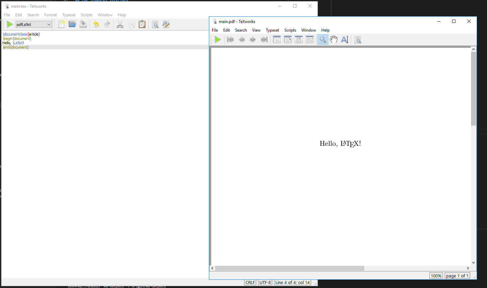
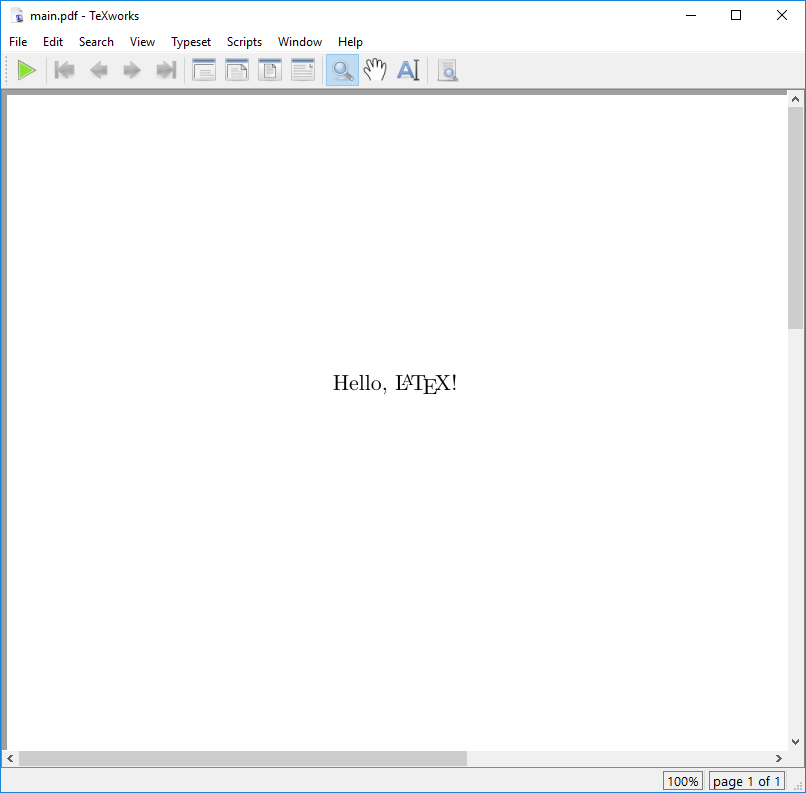

:::::::::::::::::::::::::::::::::::::: questions

- What do I need to do to write and edit a LaTeX document?
- How can I render a LaTeX document?

::::::::::::::::::::::::::::::::::::::::::::::::

::::::::::::::::::::::::::::::::::::: objectives

- Demonstrate how to create a new LaTeX Document.
- Become familiar with the TeXworks interface.
- Compile a LaTeX document with the TeXworks editor.
- Compile a LaTeX document with the command line.

::::::::::::::::::::::::::::::::::::::::::::::::

## What is LaTeX

LaTeX is a typesetting language, useful for combining text with mathematical equations, figures,
tables, and citations, among other things.

Unlike common word processors like Microsoft Word or LibreOffice Writer, LaTex is a *markup
language*, meaning that formatting (including bold text, bullet points, and changes in font size)
is indicated by the use of commands, special characters, or *environments*.

In order to produce the actual document, this mark-up text must be *compiled*. Errors in the
mark-up can either be non-fatal, meaning the document will compile with some warnings; or fatal,
meaning the document will fail to compile.

## Our First LaTeX Document

To begin with, we will create a new directory to hold our files for this workshop. Call it
`latex-workshop`, and make a note of the path to this directory.

Start the TeXworks editor and immediately "save" the file. This will prompt you for a location to
save the file, so navigate to the `latex-workshop` directory you just created, and save the file
as `main.tex`.

## The TeXworks Interface

The TeXworks interface is divided into three main sections:
- The **Editor**: This is where you write your LaTeX code. It supports syntax highlighting and
  basic code completion.
- The **Preview Pane**: This shows the compiled output of your LaTeX code. This window will appear
  whenever we compile the document.
- The **Menu Bar**: This contains various options for managing your document, such as saving,
  compiling, and printing. You can also access the preferences and settings from here.

The overall interface is designed to be simple and intuitive, focusing on the essential features
of a LaTeX editor. Note the large green triangle button in the top left corner of the interface.
This is the "Typeset" button, which compiles your LaTeX document and updates the preview pane with
the rendered output. Next to the "Typeset" button is a drop-down menu that allows you to select
the typesetting engine you wish to use. For this workshop, we will use the default engine,
PDFLaTeX.



## Compiling a LaTeX Document

Type the following code into the editor:

```latex
\documentclass{article}
\begin{document}
Hello, \LaTeX!
\end{document}
```

Now click the green "Typeset" button in the top left corner of the interface. This will compile
the document and update the preview pane with the rendered output. You should see a PDF preview
of the document with the text "Hello, LaTeX!".

::: callout

When you click the "Typeset" button, TeXworks will run the PDFLaTeX compiler on your document. You
will see a window appear on the bottom of the interface called "Console output". This window
contains the output of the compiler, including any warnings or errors that may have occurred
during the compilation process. We will talk about this in more detail in a later episode.

:::



## Compiling a LaTeX Document from the Command Line

The TeXworks editor is a convenient way to write and compile LaTeX documents, but you are not
limited to using it. Any program that can edit text files can be used to write LaTeX, which we can
then compile from the command line.

You can use any text editor to write your LaTeX code. Some popular text editors for LaTeX include:

- [Visual Studio Code](https://code.visualstudio.com/)  
- [Emacs](https://www.gnu.org/software/emacs/)  
- [Vim](https://www.vim.org/)  
- Notepad++ (Windows only)  

We will continue to demonstrate with TeXworks, but you can use any text editor you prefer.

To compile a LaTeX document from the command line, you can use the `pdflatex` command. Open a
console or terminal window, then navigate to the directory where you saved your `main.tex` file.

::: spoiler

Useful commands for navigating the command line:

- `cd <directory>`: Change directory to `<directory>`.  
- `ls` (Linux/macOS) or `dir` (Windows): List the files in the current
  directory.  
- `pwd` (Linux/macOS): Print the current working directory.

:::

Once you are in the correct directory, run the following command:

```bash
pdflatex main.tex
```

You should see output similar to the following:

```
This is pdfTeX, Version 3.141592653-2.6-1.40.28 (TeX Live 2025) (preloaded format=pdflatex)
 restricted \write18 enabled.
entering extended mode
(./main.tex
LaTeX2e <2024-11-01> patch level 2
L3 programming layer <2025-04-29>
(e:/texlive/2025/texmf-dist/tex/latex/base/article.cls
Document Class: article 2024/06/29 v1.4n Standard LaTeX document class
(e:/texlive/2025/texmf-dist/tex/latex/base/size10.clo))
(e:/texlive/2025/texmf-dist/tex/latex/l3backend/l3backend-pdftex.def)
(./main.aux)
[1{e:/texlive/2025/texmf-var/fonts/map/pdftex/updmap/pdftex.map}] (./main.aux)
)<e:/texlive/2025/texmf-dist/fonts/type1/public/amsfonts/cm/cmr10.pfb><e:/texli
ve/2025/texmf-dist/fonts/type1/public/amsfonts/cm/cmr7.pfb>
Output written on main.pdf (1 page, 21048 bytes).
Transcript written on main.log.
```

You can also use the compiler LuaLaTeX which is more powerful but might take a
little bit longer to generate the pdf.

```bash
lualatex main.tex
```

The output is this:

```
This is LuaHBTeX, Version 1.22.0 (TeX Live 2025) 
 restricted system commands enabled.
(./main.tex
LaTeX2e <2025-06-01> patch level 1
L3 programming layer <2025-07-11>
 (/usr/local/texlive/2025/texmf-dist/tex/latex/base/article.cls
Document Class: article 2025/01/22 v1.4n Standard LaTeX document class
(/usr/local/texlive/2025/texmf-dist/tex/latex/base/size10.clo))
(/usr/local/texlive/2025/texmf-dist/tex/latex/l3backend/l3backend-luatex.def)
No file main.aux.

[1{/usr/local/texlive/2025/texmf-var/fonts/map/pdftex/updmap/pdftex.map}]
(./main.aux))
 406 words of node memory still in use:
   3 hlist, 1 vlist, 1 rule, 2 glue, 3 kern, 1 glyph, 4 attribute, 48 glue_spec
, 4 attribute_list, 1 write nodes
   avail lists: 2:38,3:4,4:1,5:26,6:2,7:56,9:24
</usr/local/texlive/2025/texmf-dist/fonts/opentype/public/lm/lmroman7-regular.o
tf></usr/local/texlive/2025/texmf-dist/fonts/opentype/public/lm/lmroman10-regul
ar.otf>
Output written on main.pdf (1 page, 4850 bytes).
Transcript written on main.log.
```

Notice how the size of the pdf is about one forth when compiling with LuaLaTeX
compared to pdflatex.

In the directory where you ran the command, you should now see a new file called `main.pdf`, as well
as some other files that were created during the compilation process. The `main.pdf` file is the
rendered output of your LaTeX document, and you can open it with any PDF viewer to see the result.

::: callout

When you looked in your directory, you may have noticed that several other files were created in
addition to the `main.pdf` file. These files are:

- `main.aux`: This file contains auxiliary information used by LaTeX during the compilation
  process, such as cross-references and citations.
- `main.log`: This file contains the log output of the LaTeX compiler, including any warnings or
  errors that occurred during the compilation process.

The `main.aux` file is not something we really need to worry about at this point, but the
`main.log` file can be useful for debugging if you encounter any issues with your LaTeX document.
We'll take a closer look at the log file in a later episode.

:::


::::::::::::::::::::::::::::::::::::: challenge

## Challenge 1: NEED A NEW CHALLENGE

:::::::::::::::::::::::: solution

## Answer


:::::::::::::::::::::::::::::::::
::::::::::::::::::::::::::::::::::::::::::::::::


::::::::::::::::::::::::::::::::::::: challenge

## Challenge 2: NEED A NEW CHALLENGE

:::::::::::::::::::::::: soluti

## Answer

:::::::::::::::::::::::::::::::::
::::::::::::::::::::::::::::::::::::::::::::::::

::::::::::::::::::::::::::::::::::::: challenge

## Challenge 3: NEED A NEW CHALLENGE

:::::::::::::::::::::::: solution

## Answer


:::::::::::::::::::::::::::::::::
::::::::::::::::::::::::::::::::::::::::::::::::

::::::::::::::::::::::::::::::::::::: keypoints

- We can use the TeXworks editor to write and compile LaTeX documents.
- The TeXworks interface is divided into three main sections: the editor, the preview pane, and the menu bar.
- We can compile a LaTeX document by clicking the "Typeset" button in the TeXworks editor.
- We can also compile a LaTeX document from the command line using the
  `pdflatex` or `lualatex` command.

::::::::::::::::::::::::::::::::::::::::::::::::


