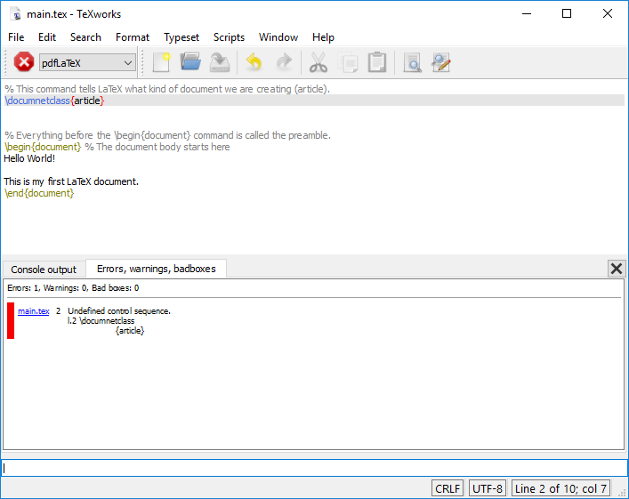

:::::::::::::::::::::::::::::::::::::: questions

- What is the basic structure of a LaTeX document?
- How do I see what my LaTeX document looks like when it's rendered?

::::::::::::::::::::::::::::::::::::::::::::::::

::::::::::::::::::::::::::::::::::::: objectives

- Become familiar with the basic structure of a LaTeX document.
- Use Overleaf to render a LaTeX document into a PDF.
- Identify how to add special characters to a LaTeX document.

::::::::::::::::::::::::::::::::::::::::::::::::

## Editing the Document
We can edit the `main.tex` file with TeXworks (or any text editor of your choice). Let's start by
creating a simple LaTeX document:

```latex
\documentclass{article}

\begin{document}
Hello World!

This is my first LaTeX document.
\end{document}
```


::: callout

Errors happen! Check that you have entered each line in the text file exactly as written above.
Sometimes seemingly small input changes give large changes in the result, including causing a
document to not work. If you are stuck, try erasing the document and copying it fresh from the
lines above.

:::

## Looking at our document

Our first document shows us the basics. LaTeX documents are a mixture of text and commands.

- *Commands* start with a backslash `\` and sometimes have arguments in curly braces `{}`.
- *Text* is what you want to appear in the document and requires no special formatting.

Let's look at the commands we've used so far:

- `\documentclass{article}`: This command tells LaTeX what kind of document we are creating. (We
  might also use this command to instruct LaTeX to use a specific font size, paper size, or other
  document settings - more on this later!)
- `\begin{document}` and `\end{document}`: These commands mark the beginning and end of the
  document body. These commands are required in every LaTeX document and create the document body.

::: callout

You can have multiple `\begin{...}` and `\end{...}` pairs in a single LaTeX document, but
you must have exactly as many `\begin{...}` commands as `\end{...}` commands.

:::

Everything before the `\begin{document}` command is called the *preamble*. The preamble is where
you set up the document, including the document class, title, author, and any other settings you
want to apply to the entire document.

## Comments

We can add comments to our document by using the `%` character. Anything after the `%` on a line is
ignored by LaTeX. As in any other programming language, comments are useful for explaining what the
code is doing. We'll start incorporating comments into our document going forward to explain some
of the specifics of the LaTeX code we're writing.

As we go, you should use your version of the document to add your own comments as a way of taking
notes on what you're learning, and to act as a reference for yourself in the future!

```latex
% This command tells LaTeX what kind of document we are creating (article).
\documentclass{article}


% Everything before the \begin{document} command is called the preamble.
\begin{document} % The document body starts here
Hello World!

This is my first LaTeX document.
\end{document}
```


::: callout

Note that the comments are displayed in a different color in the text editor. This is called
"syntax highlighting". Not all text editors will do this by default, but you can often add syntax
highlighting to your text editor of choice.

:::

Going forward, the examples we provide will not always include comments, but you should add them
to your document as you see fit.

## Rendering the Document

As with our example from the previous episode, we can render our document by clicking on the
large green "Typeset" button in TeXworks, or by running the command `pdflatex main.tex` in
our terminal/consoloe.

::: callout

When running the command in the terminal, make sure you have saved your document first, as the
command will only render the last saved version of the document.

:::

## Paragraphs

Note that we have an empty line between our two lines of text. This is important in LaTeX, as this
indicates a new paragraph. Let's try removing the empty line and recompiling the document to see
what happens.

You should see that the two lines of text are now displayed on the same line. This is because LaTeX
treats the two lines as part of the same paragraph. If you want to start a new paragraph, you need
to leave a blank line between the two paragraphs. Instead of using an empty line, there is also
the command `\par` that leads you to the same result of creating a new paragraph.
More on this in one of the challenges below.

## Special Characters

You've probably noticed by now that the characters `\`, `{`, and `}` are special characters in
LaTeX. There are others though, such as `$`, `%`, `&`, `#` and `^`. These characters tend to be
much less common in text, but you can use them by "escaping" them with a backslash. For example,

- `\%` produces `%`
- `\&` produces `&`
- `\#` produces `#`
- `\^` produces `^`

and so on.

::: spoiler

What about the `\` character?

The `\` character is used to escape other characters in latex, so it's not possible to escape it
in the same way. Instead, you can use `\textbackslash` to produce a backslash in your document.

:::


::: callout

Sometimes, special characters can, unintentionally, conflate with characters that are used after
that special character. You can prevent that by typing `{}` directly behind your special character.
The following LaTeX code gives you an example:

```latex
\documentclass{article}

\begin{document}

Here, the letter a is conflated with \^{} by typing \^ a.

To prevent that, type \^{} a.

\end{document}
```

:::


## Errors, Warnings and the Log

Inevitably, everyone makes mistakes when writing LaTeX documents. When you recompile your document,
you might not see any changes in the preview pane. This could be because there is an error in your
document. If there is an error, you will see a red number next to  the "Recompile" button over the
"Logs and output files" button. You will also see certain lines highlighted in red in the text
editor, along with a suggestion of what the error might be.

Let's introduce an error into our project to see what this might look like. Let's introduce a typo
into the `documentclass` command by changing it to `documnetclass`. When we recompile the document,
we can see our errors:

::: tab

### Errors in THe TeXworks Editor

{alt='Error in the LaTeX document.'}

The greens triangle we clicked on is now a red octagon, indicating that there is an error. There's
also now a second tab that we can see in the editor pane now, called "Errors, warnings, badboxes".
Clicking on this tab shows us something like this:



This error makes sense, given the typo we introduced. LaTeX is telling us that it has encountered
a command that it doesn't recognize, which is the `documnetclass` command. The error message
also tells us that the error is on line 2 (`l.2`) of the `main.tex` file, which is where we made
our typo.

Back in the "Console Output" tab, there's a "?", indicating that the console is waiting for us to
give it some input.

::: callout

Commands in the Console Output tab:
- Type <return> to proceed,
- S to scroll future error messages,
- R to run without stopping
- Q to run quietly,
- I to insert something
- E to edit your file
- 1 or ... or 9 to ignore the next 1 to 9 tokens of input,
- H for help
-	X to quit

:::

Let's type <return> to proceed. You should see the follow message in the console output:

```
! LaTeX Error: Missing \begin{document}.

See the LaTeX manual or LaTeX Companion for explanation.
Type  H <return>  for immediate help.
 ...

l.2 \documentclass{article}
```

Keep hitting <return> to proceed through the error messages. You will see a series of error
messages as a result of our initial error.

### Errors in the Terminal

If we run the command `pdflatex main.tex` in the terminal, we will see an error message:

{alt='Error in the terminal.'}

The text in the terminal tells us that there is an error in the `main.tex` file on line 2, and that
the command `\documnetclass` is undefined.

Keep hitting <return> to proceed through the error messages. You will see a series of error
messages as a result of our initial error.

Once we reach the end of the error messages, we can also open the `main.log` file in the project
to see a full log of the errors and warnings that were generated during the compilation.

### Fixing Errors

In general, the first error message you see is the most important one to fix. In this case, all of
the subsequent errors are related to the initial error, which is that the `\documentclass` command
is undefined. Once we fix the typo in the `\documentclass` command, the document will compile
successfully.

::: callout

The subsequent errors, talking about "missing begin document", and "font size command not defined"
are all cascading errors from the initial error. When LaTeX encounters an error, it can't continue
to compile the document, so it stops and reports the error it found. This can sometimes lead to
multiple error messages, but generally it's important to fix the first error first, as this will
often resolve subsequent errors.

:::

## Challenges

::::::::::::::::::::::::::::::::::::: challenge

## Challenge 1: What's wrong with this document?

There is an error in the following LaTeX document. Can you find it?

(Feel to make a new project in Overleaf to test this out!)

```latex
\documentclass{article}

\title{My First LaTeX Document}

I've created a new LaTeX document.

But there's an issue with it that's preventing it from rendering correctly.

Can you find and fix the error?

\end{document}
```

:::::::::::::::::::::::: solution

## Answer

Each section of a LaTeX document must be enclosed in a pair of `\begin{...}` and `\end{...}`. This
document is missing the `\begin{document}` command.

:::::::::::::::::::::::::::::::::
::::::::::::::::::::::::::::::::::::::::::::::::


::::::::::::::::::::::::::::::::::::: challenge

## Challenge 2: Displaying Special characters.

How would I display the following text in a LaTeX document?

```
5 is greater than 3 & 2 is less than 4. This is 100% true.
```

:::::::::::::::::::::::: solution

## Answer

We need to use escapes before each of the special characters. The following LaTeX code will display
the text correctly:

```latex
5 is greater than 3 \& 2 is less than 4. This is 100\% true.
```

:::::::::::::::::::::::::::::::::
::::::::::::::::::::::::::::::::::::::::::::::::

::::::::::::::::::::::::::::::::::::: challenge

## Challenge 3: Paragraphs with `\par`.

In the section about Paragraphs from above we learned that empty lines are important to create paragraphs.
However, there is also a LaTeX command called `\par` which might be of help for us.
Consider the LaTeX code below. Can you already guess which of these options prints *Hello World!* and *This is my first LaTeX document.* in two separate lines?
(Feel to make a new project in Overleaf to test this out!)

```latex
% This command tells LaTeX what kind of document we are creating (article).
\documentclass{article}

% Everything before the \begin{document} command is called the preamble.
\begin{document} % The document body starts here
% Option A
Hello World!

This is my first LaTeX document.

% Option B
Hello World! This is my first LaTeX document.

% Option C
Hello World! \par This is my first LaTeX document.

% Option D
Hello World! \par

This is my first LaTeX document.
\end{document}
```

:::::::::::::::::::::::: solution

## Answer

The command `\par` initiates a new paragraph for us even if we write text in just one line (see Option C).
Solely, Option B out of all four options does not create the intended new paragraph as neither an empty line nor `\par` is used.
Moreover, Option D gives us the same result as Option A and Option C, although we used both, `\par` and an empty line.

:::::::::::::::::::::::::::::::::
::::::::::::::::::::::::::::::::::::::::::::::::

::::::::::::::::::::::::::::::::::::: challenge


## Challenge 4: One line of code with paragraphs and special characters.

How would I display the following text in a LaTeX document but using just one line of code?

```
Hello World! This is my first LaTeX document.
Now, I know how to initiate paragraphs without an empty line.
Even more, I can write # and ^ correctly using LaTeX.
```


:::::::::::::::::::::::: solution

## Answer

We need to use `\par` to initiate a new paragraph without using a new line of code.
Moreover, we need to use escapes before each of the special characters. The following LaTeX code will display
the text correctly:

```latex
Hello World! This is my first LaTeX document. \par Now, I know how to initiate paragraphs without an empty line. \par Even more, I can write \# and \^{} correctly using LaTeX.
```

:::::::::::::::::::::::::::::::::
::::::::::::::::::::::::::::::::::::::::::::::::


::::::::::::::::::::::::::::::::::::: keypoints

- The `%` character is used to add comments to a LaTeX document.
- LaTeX documents are a mixture of text and commands.
- Commands start with a backslash `\` and sometimes have arguments in curly braces `{}`.
- We can view errors by either clicking on the "Logs and output files" or hovering over the red
    circle in the text editor.

::::::::::::::::::::::::::::::::::::::::::::::::

::: spoiler

After this episode, here is what our LaTeX document looks like:

```latex
% This command tells LaTeX what kind of document we are creating (article).
\documentclass{article}


% Everything before the \begin{document} command is called the preamble.
\begin{document} % The document body starts here
Hello World!

This is my first LaTeX document.
\end{document}
```

:::
