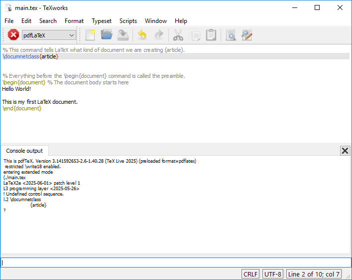
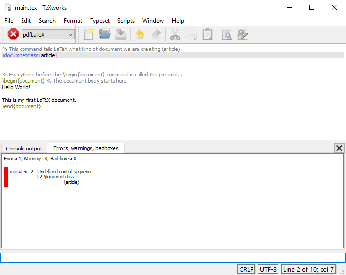
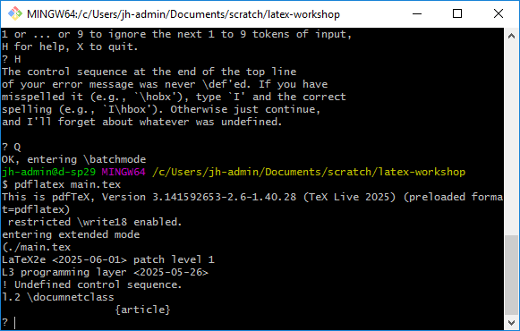

:::::::::::::::::::::::::::::::::::::: questions

- What do I do when I get an error message?

::::::::::::::::::::::::::::::::::::::::::::::::

::::::::::::::::::::::::::::::::::::: objectives

- Understand how to interpret error messages in LaTeX
- Learn how to fix common errors in LaTeX documents

::::::::::::::::::::::::::::::::::::::::::::::::

## Error Handling

Error messages in LaTeX can often be difficult to understand, especially if you're new to the
language. However there are a few common errors that we can learn to recognize and fix, and a few
techniques we can use to debug our documents based on the error messages we receive.

Inevitably, everyone makes mistakes when writing LaTeX documents. When you recompile your document,
you might not see any changes in the preview pane. This could be because there is an error in your
document. If there is an error, you will see a red number next to  the "Recompile" button over the
"Logs and output files" button. You will also see certain lines highlighted in red in the text
editor, along with a suggestion of what the error might be.

Let's introduce an error into our project to see what this might look like. Let's introduce a typo
into the `documentclass` command by changing it to `documnetclass`. When we recompile the document,
we can see our errors:

```latex
% This command is misspelled on purpose to generate an error
\documnetclass{article}

\begin{document}
Hello World!

This is my first LaTeX document.
\end{document}
```

::: tab

### Errors in the TeXworks Editor

{alt='Error in the LaTeX document.'}

The greens triangle we clicked on is now a red octagon, indicating that there is an error. There's
also now a second tab that we can see in the editor pane now, called "Errors, warnings, badboxes".
Clicking on this tab shows us something like this:



```
! Undefined control sequence.
l.2 \documnetclass
                  {article}
```

Back in the "Console Output" tab, there's a "?", indicating that the console is waiting for us to
give it some input.

::: callout

Commands in the Console Output tab:
- Type <return> to proceed,
- S to scroll future error messages,
- R to run without stopping
- Q to run quietly,
- I to insert something
- E to edit your file
- 1 or ... or 9 to ignore the next 1 to 9 tokens of input,
- H for help
-	X to quit

:::

Let's type <return> in the input box to proceed. You should see the follow message in the console
output:

```
! LaTeX Error: Missing \begin{document}.

See the LaTeX manual or LaTeX Companion for explanation.
Type  H <return>  for immediate help.
 ...

l.2 \documentclass{article}
```

Keep hitting <return> to proceed through the error messages. You will see a series of error
messages as a result of our initial error.

### Errors in the Terminal

If we run the command `pdflatex main.tex` in the terminal, we will see an error message:

{alt='Error in the terminal.'}

The text in the terminal tells us that there is an error in the `main.tex` file on line 2, and that
the command `\documnetclass` is undefined.

Keep hitting <return> to proceed through the error messages. You will see a series of error
messages as a result of our initial error.

Once we reach the end of the error messages, we can also open the `main.log` file in the project
to see a full log of the errors and warnings that were generated during the compilation.

:::

### Fixing Errors

In general, the first error message you see is the most important one to fix. In this case, all of
the subsequent errors are related to the initial error, which is that the `\documentclass` command
is undefined. Once we fix the typo in the `\documentclass` command, the document will compile
successfully.

::: callout

The subsequent errors, talking about "missing begin document", and "font size command not defined"
are all cascading errors from the initial error. When LaTeX encounters an error, it can't continue
to compile the document, so it stops and reports the error it found. This can sometimes lead to
multiple error messages, but generally it's important to fix the first error first, as this will
often resolve subsequent errors.

:::

## Anatomy of an Error Message

Let's take a closer look at one of them and see what it tells us.

```
! Undefined control sequence.
l.2 \documnetclass
                  {article}
```

This message tells us a few things:
  1. `! Undefined control sequence.`: This indicates that LaTeX encountered a command that it
     doesn't recognize. In this case, it's the misspelled `\documnetclass` command.
  2. `l.2`: This tells us that the error occurred on line 2 of the document.
  3. `\documnetclass`: This is the command that caused the error. LaTeX doesn't recognize this
     command because it is misspelled.

Of course, we know what the error was, so we can just fix it by changing `\documnetclass` back to
`\documentclass`.

::: callout

In general, the first error message in the list is the most useful one to look at. The other error
messages are often just a result of the first error cascading down the document, so fixing the first
one will often fix the rest of them too.

:::

## Common Errors

Let's take a look at some common errors you might encounter when working with LaTeX.

### Unidentified Control Sequence

We saw this one in our first example, but it can happen any where there is a command that LaTeX
doesn't recognize. This can happen if you misspell a command, or if you forget to include a package
that defines the command, of if you try to use an incorrect command.

Here's a quick example of this error:

```latex
\documentclass{article}

\begin{document}

My Amazing Content: $\alpha = \fraction{1}{(1 - \beta)^2}$

\end{document}
```

Attempting to compile this document results in the following error message:

```
! Undefined control sequence.
l.5 My Amazing Content: $\alpha = \fraction
                                           {1}{(1 - \beta)^2}$
```

So, again, we see that the error is an "Undefined control sequence", and it tells us that something
in line 5 is not defined. In this case, the command `\fraction` is not a valid LaTeX command.

### File Not Found

Here's another LaTeX excerpt:

```latex
\documentclass{article}

\usepackage{booktab}

\begin{document}

More Amazing Content!

\end{document}
```

The following error message appears when you try to compile this document:

```
! LaTeX Error: File `booktab.sty' not found.
```

This error indicates that LaTeX is unable to find the `booktab` package. The correct package name
should be `booktabs`.

### Overfull Boxes

The following code generates a warning message:

```latex
\documentclass{article}

\usepackage{graphicx}
\begin{document}

\section{Adding a rotated image}

We can rotate an image by setting the "angle" parameter:

\includegraphics[scale=2, angle=45]{example-image}
\end{document}
```

The document compiles successfully, but there was some text that briefly appeared in the console
output. Let's look at the .log file to see what it says:

```
Overfull \hbox (390.7431pt too wide) in paragraph at lines 10--11
[][]
 []


[1

{c:/texlive/2025/texmf-var/fonts/map/pdftex/updmap/pdftex.map}]
Overfull \vbox (170.7431pt too high) has occurred while \output is active []


[2 <./example-image.png>] (./main.aux)
```

This message indicates that there is an "overfull hbox" and "overfull vbox". This means that the
text or image is too wide or too tall for the page, and it is overflowing into the margins. This
is a common issue when including images in LaTeX.


## Errors vs Warnings vs Information

Not all messages are equal! LaTeX has three different types of messages:

- `Error`: This is a serious issue that will prevent your document from compiling. You need to fix
  this before you can continue.
- `Warning`: This is a less serious issue that may not prevent your document from compiling, but it
  may cause issues with the output. You should still try to fix this, but it may not be critical.
- `Information`: This is just a message that provides additional information about the document. You
  can usually ignore this.

In Overleaf, error messages are shown in red, warnings are shown in yellow, and information
messages in blue.


## Challenges

::::::::::::::::::::::::::::::::::::: challenge


# Challenge 1: Why do I get this warning?

PLACEHOLDER

:::::::::::::::::::::::: solution

PLACEHOLDER

:::::::::::::::::::::::::::::::::

::::::::::::::::::::::::::::::::::::::::::::::::


::::::::::::::::::::::::::::::::::::: keypoints

- Errors are common! Don't be discouraged by them.
- The first error message is usually the most important one to fix.
- Read the error messages carefully, they often tell you exactly what the problem is.

::::::::::::::::::::::::::::::::::::::::::::::::

