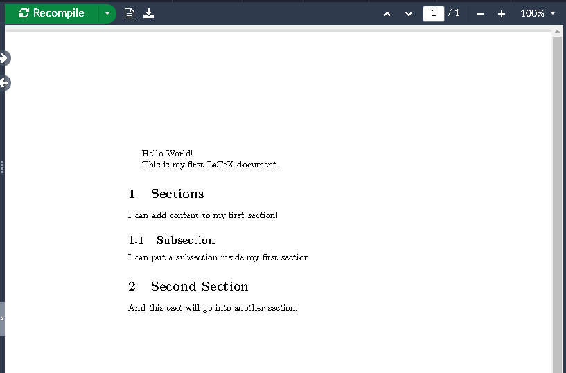

:::::::::::::::::::::::::::::::::::::: questions

- How do you write a lesson using R Markdown and `{sandpaper}`?

::::::::::::::::::::::::::::::::::::::::::::::::

::::::::::::::::::::::::::::::::::::: objectives

- Explain how to use markdown with the new lesson template
- Demonstrate how to include pieces of code, figures, and nested challenge blocks

::::::::::::::::::::::::::::::::::::::::::::::::

## Sections

In a word processor, you might use headings to organize your document.In LaTeX, we'll use the
section commands:

- `\section{...}`
- `\subsection{...}`

LaTeX will handle all of the numbering, formatting, vertical spacing, fonts, and so on in order to
keep these elements consistent throughout your document. Let's add sections to our document.

```latex
\documentclass{article}

\begin{document}
Hello World!

This is my first LaTeX document.

\section{My First Section}

I can add content to my first section!

\subsection{Details about the First section}

I can put a subsection inside of my first section.

\section{My Second Section}

And this text will go into another section.

\end{document}
```

You should have something that looks like this:

{alt='Our document with sections added.'}

::: callout

There are many different section commands in LaTeX, including `\subsubsection{...}`,
`\paragraph{...}`, `\chapter{...}`, and more. Each of these commands will create a new section
heading with a different level of indentation and numbering.

Some of these commands are only available in certain document classes, so be sure to check the
documentation for the class you are using.

:::

::::::::::::::::::::::::::::::::::::: challenge

## Challenge 1: Can you do it?


:::::::::::::::::::::::: solution

## Answer


:::::::::::::::::::::::::::::::::
::::::::::::::::::::::::::::::::::::::::::::::::

::::::::::::::::::::::::::::::::::::: keypoints

- Use `.md` files for episodes when you want static content
- Use `.Rmd` files for episodes when you need to generate output
- Run `sandpaper::check_lesson()` to identify any issues with your lesson
- Run `sandpaper::build_lesson()` to preview your lesson locally

::::::::::::::::::::::::::::::::::::::::::::::::

