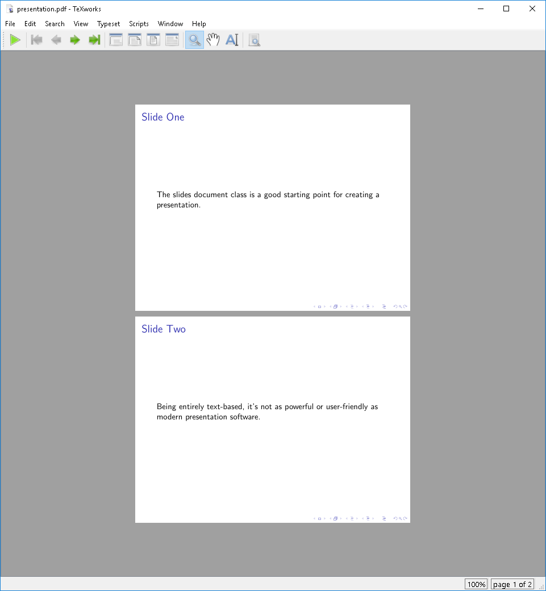

:::::::::::::::::::::::::::::::::::::: questions

- What is a LaTeX Document class?
- How does a document class affect the layout of a LaTeX document?

::::::::::::::::::::::::::::::::::::::::::::::::

::::::::::::::::::::::::::::::::::::: objectives

- Identify the various types of document classes available in LaTeX
- Create a document using an alternative document class

::::::::::::::::::::::::::::::::::::::::::::::::

## What is a Document Class?

A document class sets up the general layout of the document, including (but not limited to):

- design (margins, fonts, spacing, etc)
- availability of chapters
- title page layout

Document classes can also add new commands and environments to the document.

::: callout

Document classes can also set global options that apply to the document as a whole.

These options are set in square brackets after the document class name, for example:

```latex
\documentclass[12pt]{article}
```

But we can add other parameters to this command to change the overall layout of the document.
For example, we can set the size of the document to A4 paper by using:

```latex
\documentclass[a4paper]{article}
```

We can also change the entire document to a two-column layout by using:

```latex
\documentclass[twocolumn]{article}
```

And we can of course combine these options:

```latex
\documentclass[a4paper,12pt,twocolumn]{article}
```

:::

## The Base Document Classes

LaTeX comes with a set of standard document classes:

- `article`: a short document without chapters
- `report`: a longer document with chapters, intended for single sided printing
- `book`: a longer document with chapters, intended for double sided printing, as well as other
   features like front and back matter
- `letter`: a short document with no sections
- `slides`: a document for creating slide presentations

We're going to leave our `main.tex` file for a minute and play around with some of these document
classes.

### Writing a Letter

So far we've been using the `article` document class. Let's try using the `letter` document class
to write a letter.

::: callout

We've been working in "main.tex" so far, but we can create as many files in this project as we
want. Let's create a new file called "letter.tex" and write our letter there.

:::

```latex
\documentclass{letter}

\begin{document}

\begin{letter}{Some Address\\Some Street\\Some City}

\opening{Dear Sir or Madam,}

The text goes Here

\closing{Yours,}

\end{letter}

\end{document}
```

::: callout

Note the `\\` used to create line breaks in the address - we'll get back to line breaking in a bit.

:::

## Creating a Presentation

Base LaTeX comes with the `slides` document class, which is a very simple class for creating
slide presentations. This class is very basic and doesn't have many features, but a more modern
implementation of a presentation class is `beamer`.

The `beamer` document class is text based, and so doesn't have the same level of interactivity
as modern presentation software like PowerPoint or Google Slides. However, being text-based
does allow the usage of version control systems like Git to track changes in the
presentation, and it can be compiled to PDF for easy sharing.

Let's create a simple presentation using the `beamer` document class. Start another new document
called "slides.tex".

```latex
\documentclass{beamer}

\begin{document}

\begin{frame}
The beamer document class is a good starting point for creating a presentation.
\end{frame}

\begin{frame}
Being entirely text-based, it's not as powerful or user-friendly as modern presentation software.
\end{frame}

\end{document}
```

When you compile this document, you should end up with a document that has two pages, each with the
text of each slide centered in the middle of the page.



## Function-rich Classes

The core classes included with base LaTeX are very stable, but this means they are also somewhat
conservative in terms of features. Over time, third parties have developed a number of more
powerful classes that add new features and functionality to LaTeX documents.

These include:

- `amsbook`, `amsart`, and `amsproc`: classes for documents that use the American Mathematical
  Society's style
- `beamer`: a class for creating slide presentations
- `KOMA-Script`: a set of classes that provide a more modern look and feel to LaTeX documents by
                 providing parallel classes to the base classes (`scrbook`, `scrartcl`).
- `memoir`: a class that provides a lot of functionality for creating books, reports, and articles

These classes have a lot of customization options that can be used to alter the appearance of the
document to exactly match your needs. We'll explore how to figure out how to use these classes in
a later episode.

## Challenges

::::::::::::::::::::::::::::::::::::: challenge

## Challenge 1: Which don't belong?

Which of the following are not a standard LaTeX document class?

- `article`
- `report`
- `book`
- `letter`
- `presentation`
- `memoir`

:::::::::::::::::::::::: solution

## Answer

`presentation` is not a standard LaTeX document class - the correct class is `slides`. Also
`memoir` is not a standard LaTeX document class, but a third-party class.

:::::::::::::::::::::::::::::::::
:::::::::::::::::::::::::::::::::::::

::::::::::::::::::::::::::::::::::::: challenge


## Challenge 2: What happens?

Suppose we have the following LaTeX slide presentation, but we want to turn it into an article.
We can change the document class from "slides" to "article", but what happens? And why?

```latex
\documentclass{slides}

\begin{document}

\begin{slide}
Apples are an edible fruit produced by an apple tree. The tree originated in Central Asia, but
has since been introduced to many other regions.
\end{slide}

\begin{slide}
Some popular apple varieties include:
\begin{itemize}
  \item Gala
  \item Fuji
  \item Golden Delicious
\end{itemize}
\end{slide}

\end{document}
```

:::::::::::::::::::::::: solution

We can change the document class from "slides" to "article", but the `slide` environment does not
exist in the `article` document class. We end up with errors when we try to compile the document,
complaining that the `slide` environment is not defined. We need to change the `slide` environments
to `sections` or `subsections` to maintain the structure of the document:

```latex
\documentclass{article}

\begin{document}

\section{Apples}
Apples are an edible fruit produced by an apple tree. The tree originated in Central Asia, but
has since been introduced to many other regions.

\subsection{Popular Apple Varieties}
Some popular apple varieties include:
\begin{itemize}
  \item Gala
  \item Fuji
  \item Golden Delicious
\end{itemize}

\end{document}
```

:::::::::::::::::::::::::::::::::
::::::::::::::::::::::::::::::::::::::::::::::::

::::::::::::::::::::::::::::::::::::: challenge


## Challenge 3: Make your own beamer slides

Consider the following minimal example of an initial `beamer` presentation. Let's create a new file
called "beamer.tex" and copy the following code as a template into it:

```latex
\documentclass{beamer}
%Information to be included in the title page:
\title{Sample title}
\author{Anonymous}
\institute{My Institution}
\date{2021}

\begin{document}

\frame{\titlepage}

\begin{frame}
\frametitle{Sample frame title}
This is some text in the first frame. This is some text in the first frame. This is some text in
the first frame.
\end{frame}

\end{document}
```

Adapt these slides in the following way:

1. Change the title to "LaTeX Workshop"
2. Change the name of the author to your name.
3. Change the institution name to "ABCD Project Group".
4. Change the date to "2025".
5. Change the frame title of the first slide after the title page to "What I have learned in this
   episode" and replace the example text on the slide with your key takeaway from this section.
6. Besides the title page and the slide after the title page, create a third slide with the title
   "What I learned in the previous episodes".
7. Add an unordered list as content to this slide and describe in three bullet points your key
   takeaways from the previous episodes.


:::::::::::::::::::::::: solution


```latex
\documentclass{beamer}
%Information to be included in the title page:
\title{LaTeX Workshop}
\author{My Name}
\institute{ABCD Project Group}
\date{2025}

\begin{document}

\frame{\titlepage}

\begin{frame}
\frametitle{What I have learned in this episode}
My key takeaway from this episode.
\end{frame}

\begin{frame}
\frametitle{What I learned in the previous episodes}
\begin{itemize}
  \item Key learning 1
  \item Key learning 2
  \item Key learning 3
\end{itemize}
\end{frame}

\end{document}
```

:::::::::::::::::::::::::::::::::
::::::::::::::::::::::::::::::::::::::::::::::::


::::::::::::::::::::::::::::::::::::: keypoints

- LaTeX document classes set the general layout of the document
- The base document classes are `article`, `report`, `book`, `letter`, and `slides`
- Third-party classes can provide additional features

::::::::::::::::::::::::::::::::::::::::::::::::

::: spoiler

After this episode, [here is what our LaTeX document looks like](files/document_state/ep-04.tex).

:::
