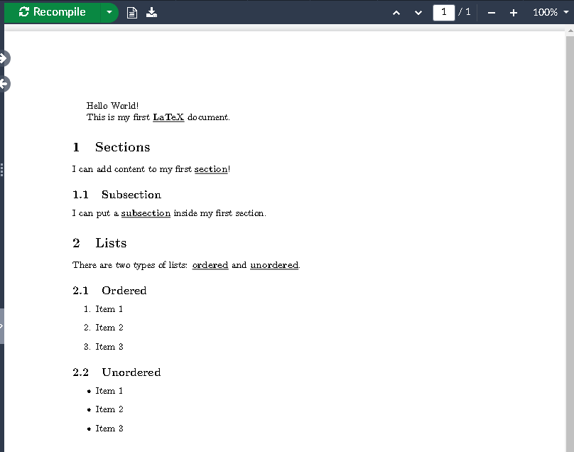
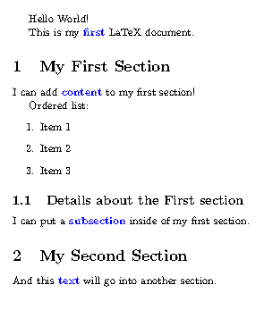

:::::::::::::::::::::::::::::::::::::: questions

- How can I extend LaTeX to suit my needs?
- How can I define my own commands in LaTeX?

::::::::::::::::::::::::::::::::::::::::::::::::

::::::::::::::::::::::::::::::::::::: objectives

- Demonstrate how to extend LaTeX using packages.
- Add custom commands to a LaTeX document.

::::::::::::::::::::::::::::::::::::::::::::::::

## Adding Packages

After we've declared a class, we can use the preamble section of our document to add one or more
packages in order to extend LaTeX's functionality. Packages are collections of commands and
environments that add new features to LaTeX, for example:

- Changing how some parts of LaTeX work.
- Adding new commands.
- Changing the appearance/design of the document.

## Changing how LaTeX works

The "kernel" of LaTeX is quite limited in terms of user customization, as some add-on packages deal
with fairly common ideas. For example, how LaTeX deals with language-specific typesetting (e.g.
hyphenation, quotation marks, punctuation, localization) is handled by the `babel` package.

An example:

```latex
\documentclass{article}

\usepackage[width = 6cm]{geometry} % To force hyphenation here

\begin{document}

This is a lot of filler which is going to demonstrate how LaTeX hyphenates
material, and which will be able to give us at least one hyphenation point.
This is a lot of filler which is going to demonstrate how LaTeX hyphenates
material, and which will be able to give us at least one hyphenation point.

\end{document}
```

This will produce a document with a narrow text block, which will force LaTeX to hyphenate words in
order to fit them in the available space. Try adding a `%` before the `\usepackage` line and
rendering the document again to see the difference.

::: callout

Different languages have different rules around hyphenation, quotation marks, punctuation, etc.
We can use the `babel` package to set these rules for different languages like this:

```latex
\usepackage[english]{babel}
```

or

```latex
\usepackage[german]{babel}
```

:::

## Changing the Design

It's useful to be able to adjust some aspects of the design independent of the document class, for
example, the page margins. We used the `geometry` package in our previous example to set the width
of the text block, but now let's use it to specifically set the margins of our document:

::: callout

So far we've been showing the entire document in the examples. Going forward, we'll only show the
relevant sections of the document that we're discussing, so keep in mind when we are talking about
"adding this to the preamble" we mean adding it to the section of the document *before* the
`\begin{document}` command.

:::

Let's add this to the preamble of our document:

```latex
\documentclass{article}
```

You should see that adding this package and setting the "margin" option to `1in` has shrunk the
margins of the document (try commenting out the `\usepackage` line with a `%` and recompiling to
see the difference).

## Defining Custom Commands

Using other people's packages is great, but what if there is some kind of functionality we want to
add to our document that isn't covered by a package? Or some specific formatting we want to use
repeatedly? We can define our own commands in LaTeX using the `\newcommand` command.

The `\newcommand` syntax looks like this:

```latex
\newcommand{\commandname}[number of arguments]{definition}
```

As an example, let's define a command that will highlight specific works in a document, so that
they appear italicised and underlined. We *could* do this by writing `\textbf{\underline{word}}`
around each word we want to highlight:

```latex
This is my first \textbf{\underline{LaTeX}} document.

\section{Sections}

I can add content to my first \textbf{\underline{section}}!
```

We can add this to each of our important terms in our document - maybe it looks something like this:

{alt='Our document with keywords highlighted in bold and underlined.'}


In a long document this would quickly become tedious. Instead, let's define a new command called
`\kw` in the preamble of our document that will do this for us:

```latex
% Highlight Keywords using the \kw{} command
\newcommand{\kw}[1]{\textbf{\underline{#1}}}
```

::: callout

The line starting with `%` is a comment in LaTeX. Comments are ignored by the LaTeX compiler and
are used to add notes to the document for the author's reference.

:::

Now we can use the `\kw` command to highlight words in our document:

```latex
This is my first \kw{LaTeX} document.

\section{Sections}

I can add content to my first \kw{section}!
```

This also means that we can easily change the formatting of all the words we've highlighted by
updating the definition of the `\kw` command. Let's say we wanted to change the formatting to bold
and change the color to blue:

::: callout

Standard LaTeX does not have a built-in way to change the color of text, but we can use the
`xcolor` package to do this by adding the `\usepackage{xcolor}` line to the preamble of our
document

:::

Let's replace our `\kw` command with this new definition:
`\newcommand{\kw}[1]{\textcolor{blue}{\textbf{#1}}}`

When we recompile the document we should see that the formatting of our keywords has changed all at
once:

{alt='Our document with keywords highlighted in blue.'}

::::::::::::::::::::::::::::::::::::: challenge

## Challenge 1: Importing a new package

A useful package to preview what your document will look like before your write a lot of text is
the `lipsum` package. This package provides sample text blocks from a common placeholder text.

How would you add the lipsum package to the preamble of your document?

:::::::::::::::::::::::: solution

## Answer

Add the line `\usepackage{lipsum}` to the preamble of your document.

You can then use the `\lipsum` command in the body of your document to add some dummy text.

:::::::::::::::::::::::::::::::::

::::::::::::::::::::::::::::::::::::::::::::::::

::::::::::::::::::::::::::::::::::::: challenge

## Challenge 2: What does this mean?

The definition of a new command in LaTeX is done with the `\newcommand` command. The syntax for this
command is:

```latex
\newcommand{\commandname}[number of arguments]{definition}
```

So if we modify the `\kw` command we defined above to look like this:

```latex
\newcommand{\kw}[2]{\textcolor{#1}{\textbf{#2}}}
```

What would the new `\kw` command do? and how would we use it?

:::::::::::::::::::::::: solution

## Output

The new `\kw` command would take two arguments: the first argument would be the color we want to
use to highlight the word, and the second argument would be the word we want to highlight. We would
use it like this:

```latex
\kw{red}{my keyword}
```


:::::::::::::::::::::::::::::::::

::::::::::::::::::::::::::::::::::::::::::::::::

::::::::::::::::::::::::::::::::::::: keypoints

- Use `.md` files for episodes when you want static content
- Use `.Rmd` files for episodes when you need to generate output
- Run `sandpaper::check_lesson()` to identify any issues with your lesson
- Run `sandpaper::build_lesson()` to preview your lesson locally

::::::::::::::::::::::::::::::::::::::::::::::::

::: spoiler

After this episode, here is what our LaTeX document looks like:

```latex
\documentclass{article}
\usepackage[margin=1in]{geometry}

% Highlight Keywords using the \kw{} command
\newcommand{\kw}[1]{\textbf{\underline{#1}}}

\begin{document}
Hello World!

This is my first \kw{LaTeX} document.

\section{Sections}

I can add content to my first \kw{section}!

\subsection{Subsection}

I can put a \kw{subsection} inside my first section.

\section{Lists}

There are two types of lists: \kw{ordered} and \kw{unordered}.

\subsection{Ordered}

\begin{enumerate}
  \item Item 1
  \item Item 2
  \item Item 3
\end{enumerate}

\subsection{Unordered}

\begin{itemize}
  \item Item 1
  \item Item 2
  \item Item 3
\end{itemize}

\end{document}
```

:::
