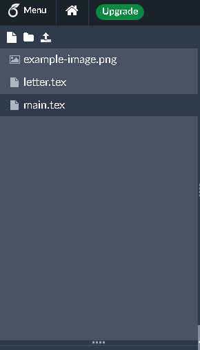

:::::::::::::::::::::::::::::::::::::: questions

- How do I include images in a LaTeX document?

::::::::::::::::::::::::::::::::::::::::::::::::

::::::::::::::::::::::::::::::::::::: objectives

- Demonstrate how to include images in a LaTeX document.
- Show how to position images manually / automatically in a LaTeX document.

::::::::::::::::::::::::::::::::::::::::::::::::

## The Graphicx Package

In order to use graphics in our document, we'll need to use the `graphicx` package, which adds the
`\includegraphics` command to LaTeX. We'll add this to the preamble of our document:

```latex
\usepackage{graphicx}
```

We can now include several types of images in our document, including:

- JPEG
- PNG
- PDF
- EPS

For the purposes of this lesson, we'll use the following image:

{alt='Our example image.'}

::: callout

Download this image to your computer either be right-clicking on the image and selecting "Save
Image As..." or by clicking on the image and saving it from the browser.

You can use any image you like for this lesson. Just make sure to replace `example-image.PNG` with
the name of your image in the following examples.

:::

### Uploading Images to Overleaf

In order to incorporate an image into our document, we'll need to upload it to Overleaf. We can do
this by clicking on the "Upload" icon on the upper left corner of the Overleaf editor:

{alt='The upload icon in Overleaf.'}

We can then either drag and drop the image into the upload window or click on the "Select files"
button to choose the image from our computer.

Once you have uploaded the image, you should see it in the "Files" section of the Overleaf editor:

{alt='The uploaded image in Overleaf.'}

::: spoiler

You can also use the "From external URL" option to add an image directly from a URL, which would
let you use an image from a website directly without having to download it first.

:::

## Including an Image in a LaTeX Document

Now that we have our image uploaded, we can include it in our document using the `\includegraphics`
command:

```latex
\section{Graphics}

We can include \kw{images} in our document using the \cmd{graphicx} package, which lets us use the
\cmd{includegraphics} command.

\includegraphics{example-image.PNG}
```

Your document should now look like this:

{alt='Our document with an included image.'}

::: callout

If you just want to see how an image might look in your document without having to upload one, you
can use the filepath `example-image` in the `\includegraphics` command. This will display a
placeholder image in your document that you can replace later.

:::

### Adjusting the appearance of the image

But wait! The image is too big, and it doesn't fit on the page, so LaTeX has moved it to the next
page. Since the image is a little too large to fit on the same page as the text, LaTeX has moved it
automatically to the next page. Let's address that by making the image smaller.

We can adjust the appearance of the image by passing options to the `\includegraphics` command, just
like we did earlier with the `geometry` package. For example, we can specify the height of the
image:

```latex
\subsection{Small Image}

We can pass parameters to the \cmd{includegraphics} command to adjust the appearance of the image.

\includegraphics[height=2cm]{example-image.PNG}

Other possible options include:

\begin{itemize}
  \item width: the width of the image
  \item scale: the scaling factor of the image
  \item angle: the angle of rotation of the image
  \item clip: whether to clip the image to its bounding box
  \item trim: trim the image by a specified amount
  \item draft: display a box instead of the image
\end{itemize}
```

{alt='Our document with a smaller image.'}

::: callout

Some other possible options from the `graphicx` package include:

- `width`: the width of the image
- `scale`: the scaling factor of the image
- `angle`: the angle of rotation of the image
- `clip`: whether to clip the image to its bounding box
- `trim`: trim the image by a specified amount
- `draft`: display a box instead of the image

:::

### Positioning the image

We can place the image inside of an environment to help position it in the document. Let's try
placing the `\includegraphics` command inside of a `\begin{center}` and `\end{center}` environment:

```latex
\subsection{Centered Image}

By placing the \cmd{includegraphics} command inside a center environment, we can center the
image on the page.

\begin{center}
  \includegraphics[height=2cm]{example-image.PNG}
\end{center}
```

You should see that the image is now centered on the page:

{alt='Our document with a centered image.'}

## "Floating" Images

It's often the case that images need to "float" around the document as new text is added or removed.
this is called a "floating" image. Images are normally included as floats so that we don't end up
with large gaps in the document.

To make an image float, we can use the `figure` environment:

```latex
\subsection{Floating Image}

\kw{Floating images} can move around the page as text is added or removed. We can use the
\cmd{figure}environment to create a floating image.

\begin{figure}
  \centering
  \includegraphics[height=2cm]{example-image.PNG}
\end{figure}
```

When we render the document, we can see that, even though we placed the image at the end of the
document, it appears at the top of the page:

{alt='Our document with a floating image.'}

::: callout

You might have noticed that instead of using the `\begin{center}` and `\end{center}` environment,
we used the `\centering` command inside of the `figure` environment. This is because the `figure`
environment is a floating environment, and the `\centering` command is the recommended way to
center content inside of a floating environment.

:::

### Controlling the Position of a Floating Image

We can pass parameters to the `figure` environment to control the position of the floating image:

- `h`: Place the float "here" (where it appears in the code)
- `t`: Place the float at the "top" of the page
- `b`: Place the float at the "bottom" of the page
- `p`: Place the float on a "page" by itself

It is also possible to combine these options. For example, to place the float here if possible, but
otherwise at the top of the page, we can use the `ht` option. Let's update our `figure` environment
to use the `ht` option:

```latex
\begin{figure}[ht]
  \centering
  \includegraphics[height=2cm]{example-image.PNG}
\end{figure}

Control the position of a floating image by passing parameters to the \cmd{figure} environment:

\begin{itemize}
  \item h: Place the float "here" (where it appears in the code)
  \item t: Place the float at the "top" of the page
  \item b: Place the float at the "bottom" of the page
  \item p: Place the float on a "page" by itself
\end{itemize}

```

### Adding a Caption

We can add a caption to our image by using the `\caption` command inside of the `figure` environment:

```latex
\subsection{Caption}

We can add a \kw{caption} to our floating image by using the \cmd{caption} command inside of the
\cmd{figure} environment.

\begin{figure}
  \centering
  \includegraphics[height=2cm]{example-image.PNG}
  \caption{This is a caption for our image.}
\end{figure}
```

When we render the document, we can see that the caption appears below the image:

{alt='Our document with a floating image.'}

::: callout

Note that the caption is automatically numbered "Figure 1". Very handy! We'll see how we can
automatically reference figures and tables in a later episode.

:::

::: spoiler

Another package that we can use to work with images in LaTeX is the `hvfloat` package. This package
is an alterantive way of controlling the position of floating elemnents in LaTeX, like images
and tables. It provides a more flexible way of positioning floats allowing us to, for example,
place a float at the bottom of the page, even if there is not enough space for it to fit.

:::

## Challenges

::::::::::::::::::::::::::::::::::::: challenge

## Challenge 1: Can you do it?

Create a new document in Overleaf and add the "example-image" image to it. Using the `graphicx`
package, how would you rotate the image 45 degrees?

:::::::::::::::::::::::: solution

We can use the `angle` option in the `\includegraphics` command to rotate the image:

```latex
\documentclass{article}
\usepackage{graphicx}

\begin{document}

\includegraphics[angle=45]{example-image.png}

\end{document}
```

:::::::::::::::::::::::::::::::::


## Challenge 2: Making a command for images

In the previous section, we created a command to highlight keywords in our document. Let's create
a new command to make it easier to include images in our document. We'll create a command called
`\centeredimage` that takes two arguments: the image filename and the caption. The resulting image
should be centered on the page and have a caption below it. Use the example-image.png from earlier
in this episode.

Your file should look like this:

```latex
\documentclass{article}
\usepackage{graphicx}

% Define our new command
%%% YOUR COMMAND HERE %%%

\begin{document}

\centeredimage{example-image.png}{"My Image"}
\centeredimage{example-image.png}{"My Other Image"}

\end{document}
```

And your output should look [like this](fig/06-using-graphics/challenge-image-command-output.PNG).

Reminder: The syntax for creating a new command is:

```latex
\newcommand{\cmdname}[numargs]{definition}
```

:::::::::::::::::::::::: solution

```latex
\documentclass{article}
\usepackage{graphicx}

% Define our new command
\newcommand{\centeredimage}[2]{
  \begin{figure}
    \centering
    \includegraphics{#1}
    \caption{#2}
  \end{figure}
}

\begin{document}

\centeredimage{example-image.png}{"My Image"}
\centeredimage{example-image.png}{"My Other Image"}

\end{document}
```

:::::::::::::::::::::::::::::::::
::::::::::::::::::::::::::::::::::::::::::::::::

::::::::::::::::::::::::::::::::::::: challenge

## Challenge 3: Clipping and Trimming

We didn't really talk about the `clip` and `trim` options in the `graphicx` package, but they are
very useful for customizing the appearance of images.

- The `clip` option allows us to clip the image to its bounding box, which can be useful for removing
  unwanted parts of the image.
- The `trim` option allows us to trim the image by a specified amount, which can be useful for
  removing whitespace around the image.

These options are generally used together. The `trim` option takes four arguments seperated by
spaces, each indicating a direction to trim the image from. `clip` is a boolean option - if it is
present, the image will be clipped.

Using the `example-image` image, create a new document that uses the `clip` and `trim` options to
display something like [this](fig/06-using-graphics/challenge-trimmed-image.PNG).

(You don't have to be exact, just make sure to use the `clip` and `trim` options.)

:::::::::::::::::::::::: solution

The parameters in the `trim` option are in the order of left, bottom, right, and top. The values
in this example are in centimeters, but you can also use other units like inches or millimeters.

Here's one way to do it:

```latex
\documentclass{article}
\usepackage{graphicx}

\begin{document}

\includegraphics[clip, trim=0.5cm 0.5cm 6.5cm 4cm]{example-image.PNG}
\includegraphics[clip, trim=3cm 3cm 3cm 3cm]{example-image.PNG}
\includegraphics[clip, trim=3cm 4cm 4cm 0.5cm]{example-image.PNG}

\end{document}
```

:::::::::::::::::::::::::::::::::
::::::::::::::::::::::::::::::::::::::::::::::::


::::::::::::::::::::::::::::::::::::: keypoints

- The `graphicx` package allows us to include images in our LaTeX document.
- We can adjust the appearance of images using options in the `\includegraphics` command.
- We can position images manually or automatically using environments like `center` and `figure`.
- Floating images can move around the page as text is added or removed.
- We can control the position of floating images using parameters in the `figure` environment.
- We can add captions to floating images using the `\caption` command.

::::::::::::::::::::::::::::::::::::::::::::::::

::: spoiler

After this episode, here is what our LaTeX document looks like:

```latex
% This command tells LaTeX what kind of document we are creating (article).
\documentclass{article}

\usepackage[margin=1in]{geometry}
\usepackage{xcolor}
\usepackage{graphicx}

% Highlight Keywords using \kw{}
\newcommand{\kw}[1]{\textcolor{blue}{\textbf{#1}}}

% Italics for commands with \cmd{}
\newcommand{\cmd}[1]{\textit{#1}}

% Everything before the \begin{document} command is called the preamble.
\begin{document} % The document body starts here
Hello World!

This is my first \kw{LaTeX} document.

% The section command automatically numbers and formats the section heading.
\section{Sections}

I can add content to my first \kw{section}!

% The subsection command does the same thing, but for sections within sections.
\subsection{Subsection}

I can put a \kw{subsection} inside my first section.

\section{Lists}

There are two types of \kw{lists}: \kw{ordered} and \kw{unordered}.

\subsection{Ordered}

Ordered lists do not have numbers associated with each item.

\begin{enumerate}
  \item Item 1
  \item Item 2
  \item Item 3
\end{enumerate}

\subsection{Unordered}

Unordered lists are just a series of items preceded by a marker.

\begin{itemize}
  \item Item 1
  \item Item 2
  \item Item 3
\end{itemize}

\section{Graphics}

We can include \kw{images} in our document using the \cmd{graphicx} package, which lets us use the
\cmd{includegraphics} command.

\includegraphics{example-image.PNG}

\subsection{Small Image}

We can pass parameters to the \cmd{includegraphics} command to adjust the appearance of the image.

\includegraphics[height=4cm]{example-image.PNG}

\begin{itemize}
  \item width: the width of the image
  \item scale: the scaling factor of the image
  \item angle: the angle of rotation of the image
  \item clip: whether to clip the image to its bounding box
  \item trim: trim the image by a specified amount
  \item draft: display a box instead of the image
\end{itemize}

\subsection{Centered Image}

By placing the \cmd{includegraphics} command inside a center environment, we can center the
image on the page.

\begin{center}
  \includegraphics[height=2cm]{example-image.PNG}
\end{center}

\subsection{Floating Image}

\kw{Floating images} can move around the page as text is added or removed. We can use the
\cmd{figure}environment to create a floating image.

\begin{figure}[ht]
  \centering
  \includegraphics[height=2cm]{example-image.PNG}
\end{figure}

Control the position of a floating image by passing parameters to the \cmd{figure} environment:

\begin{itemize}
  \item h: Place the float "here" (where it appears in the code)
  \item t: Place the float at the "top" of the page
  \item b: Place the float at the "bottom" of the page
  \item p: Place the float on a "page" by itself
\end{itemize}

\subsection{Caption}

We can add a \kw{caption} to our floating image by using the \cmd{caption} command inside of the
\cmd{figure} environment.

\begin{figure}[ht]
  \centering
  \includegraphics[height=2cm]{example-image.PNG}
  \caption{This is a caption for our image.}
\end{figure}

\end{document}
```

:::
