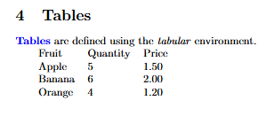
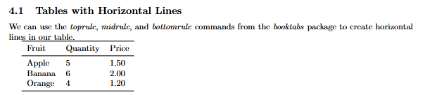
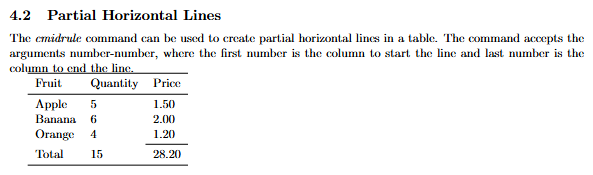
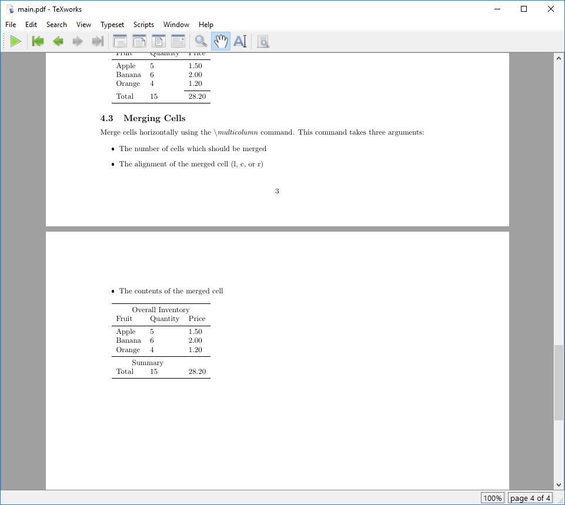

:::::::::::::::::::::::::::::::::::::: questions

- How do I add tables to a LaTeX document?
- How can I format a table in a LaTeX document?

::::::::::::::::::::::::::::::::::::::::::::::::

::::::::::::::::::::::::::::::::::::: objectives

- Create a table in a LaTeX document.
- Customize the appearance of a table in a LaTeX document.
- Add horizontal lines to a table in a LaTeX document.

::::::::::::::::::::::::::::::::::::::::::::::::

## Defining Tables

Tables in LaTeX are set using the `tabular` environment. For our purposes here, we are going to
use the `array` package to create a table, which provides additional functionality for creating
tables. We'll add this to the preamble of our document:

```latex
\usepackage{array}
```

::: callout

As we start to add more and more packages to our preamble, it can get a bit unwieldy. For now,
let's just keep them alphabetized to make it keep things organized. Our imports should now look
like this:

```latex
\usepackage{array}
\usepackage[margin=1in]{geometry}
\usepackage{graphicx}
\usepackage{xcolor}
```

:::

In order to create a table, we need to tell latex how may columns we will need and how they should
be aligned.

Available column types are:

| Column Type       | Description   |
|-------------------|---------------|
| `l`               | left-aligned  |
| `c`               | centered      |
| `r`               | right-aligned |
| `p{width}`        | a column with fixed width width; the text will be automatically line wrapped and fully justified |
| `m{width}`        | like p, but vertically centered compared to the rest of the row |
| `b{width}`        | like p, but bottom aligned |
| `w{align}{width}` | prints the contents with a fixed width, silently overprinting if things get larger. (You can choose the horizontal alignment using l, c, or r.) |
| `W{align}{width}` | like w, but this will issue an overfull box warning if things get too wide. |

::: callout

The columns l, c and r will have the natural width of the widest entry in the column. Each column
must be declared, so if you want a table with three centered columns, you would use `ccc` as the
column declaration.

:::

## Creating a Table

Now that we have the array package loaded and we know how to define columns, we can create a table
using the `tabular` environment.

::: callout

Note that the `&` and `\\` characters are aligned in our example. This isn't strictly necessary in
LaTeX, but it makes the code much easier to read.

:::

```latex
\section{Tables}

\kw{Tables} are defined using the \cmd{tabular} environment.

\begin{tabular}{lll}
  Fruit  & Quantity & Price \\
  Apple  & 5        & 1.50  \\
  Banana & 6        & 2.00  \\
  Orange & 4        & 1.20  \\
\end{tabular}
```

This will create a table with three columns, all left-aligned. The values of each row are separated
by `&` and the rows are separated by `\\`. We do not yet have any horizontal lines in the table, so
it will look like this:

{alt='Example output of a simple table'}

::: callout

If your table has many columns, it may get cumbersome to write out the column definitions every
time. In this case you can make things easier by using `*{num}{string}` to repeat the string `num`
times. For example, in our table above, we can instead write:

```latex
\begin{tabular}{*{3}{l}}
  Fruit  & Quantity & Price \\
  Apple  & 5        & 1.50  \\
  Banana & 6        & 2.00  \\
  Orange & 4        & 1.20  \\
\end{tabular}
```

:::

## Adding Horizontal Lines

We're going to introduce another package here: `booktabs`. This package provides a few commands
that make it easier to create professional looking tables. To use it, add the following to your
preamble:

```latex
\usepackage{booktabs}
```

`booktabs` provides three commands for creating horizontal lines in your table:

- `\toprule`: creates a line at the top of the table
- `\midrule`: creates a line in the middle of the table
- `\bottomrule`: creates a line at the bottom of the table

Horizontal lines make tables easier to read and understand, and they can be used to separate the
header from the body of the table, and the body from the footer. We can insert these commands into
our table to add horizontal lines:

```latex
\subsection{Tables with Horizontal Lines}

We can use the \cmd{\textbackslash toprule}, \cmd{\textbackslash midrule}, and
\cmd{\textbackslash bottomrule} commands from the \cmd{booktabs} package to create horizontal
lines in our table.

\begin{tabular}{*{3}{l}}
  \toprule
  Fruit  & Quantity & Price \\
  \midrule
  Apple  & 5        & 1.50  \\
  Banana & 6        & 2.00  \\
  Orange & 4        & 1.20  \\
  \bottomrule
\end{tabular}
```

Your table should look something like this:

{alt='Example output of a table with horizontal
lines'}

::: callout

A general recommendation is to use lines sparsely in your tables, and vertical lines should be
avoided.

:::

## Partial Horizontal Lines

Another useful feature of `booktabs` is the ability to create partial horizontal lines with the
`\cmidrule` command. This command accepts the arguments {number-number}, where the first number is
the column to start the line and the second number is the column to end the line.

```latex
\subsection{Partial Horizontal Lines}

The \cmd{\textbackslash cmidrule} command can be used to create partial horizontal lines in a
table. The command accepts the arguments {number-number}, where the first number is the column to
start the line and last number is the column to end the line.

\begin{tabular}{*{3}{l}}
  \toprule
  Fruit  & Quantity &  Price \\
  \midrule
  Apple  & 5        &  1.50  \\
  Banana & 6        &  2.00  \\
  Orange & 4        &  1.20  \\
  \cmidrule{3-3}
  Total & 15        & 28.20  \\
  \bottomrule
\end{tabular}

```

This table should come out looking something like this:

{alt='Example output of a table with partial
lines'}


## Merging Cells

We can merge cells horizontally using the `\multicolumn` command. This command takes three
arguments:

- The number of cells which should be merged
- The alignment of the merged cell (l, c, or r)
- The contents of the merged cell

```latex
\subsection{Merging Cells}

Merge cells horizontally using the \cmd{\textbackslash multicolumn} command. This command takes
three arguments:

\begin{itemize}
  \item The number of cells which should be merged
  \item The alignment of the merged cell (l, c, or r)
  \item The contents of the merged cell
\end{itemize}

\begin{tabular}{*{3}{l}}
  \toprule
  \multicolumn{3}{c}{Overall Inventory} \\
  Fruit  & Quantity &  Price  \\
  \midrule
  Apple  & 5        &  1.50   \\
  Banana & 6        &  2.00   \\
  Orange & 4        &  1.20   \\
  \midrule
  \multicolumn{2}{c}{Summary} \\
  Total & 15        & 28.20   \\
  \bottomrule
\end{tabular}
```

::: callout

Vertical merging is not supported in LaTeX. Usually it is sufficient to leave empty rows in the
table to create the impression of vertical merging.

:::

This will create a table that looks like this:

{alt='Example output of a table with merged cells'}

## Challenges

::::::::::::::::::::::::::::::::::::: challenge

## Challenge 1: Can you do it?

Try to replicate the following table in LaTeX:

| Make        | Model     | Sold     |
|-------------|-----------|----------|
| Volkswagen  | Golf      | 7,687    |
| Skoda       | Octavia   | 4,078    |
| Seat        | Leon      | 3,922    |
| Volkswagen  | Passat    | 3,776    |
| Mercedes    | GLK,GLC   | 3,143    |
|             | **Total** | *22,606* |

Your LaTaX version should look something like [this](fig/07-tables/challenge-make-a-table.PNG ).

Note that the last row is a bit different from the others. The first two columns re merged, the
text "Total" is right-aligned and bold, and the value in the last column is italicized.

(Data for this challenge is from
[Statista](https://www.statista.com/statistics/1546704/monthly-best-selling-car-models-in-germany/))

:::::::::::::::::::::::: solution

## Answer

```latex
\documentclass{article}

\usepackage{array}
\usepackage{booktabs}

\begin{document}

\begin{tabular}{lll}
  \toprule
  Make        & Model   & Sold   \\
  \midrule
  Volkswagen  & Golf    & 7,687 \\
  Skoda       & Octavia & 4,078 \\
  Seat        & Leon    & 3,922 \\
  Volkswagen  & Passat  & 3,776 \\
  Mercedes    & GLK,GLC & 3,143 \\
  \midrule
  \multicolumn{2}{r}{\textbf{Total}} & \textit{22,606} \\
  \bottomrule
\end{tabular}

\end{document}
```

:::::::::::::::::::::::::::::::::


## Challenge 2: Are Tables like Images?

When we were working with graphics in the previous section, we learned about adding captions to
images. Can you add a caption to the table you created in Challenge 1 that says "Car Sales by
Make/Model (January 2025)"? (Make sure the table is centered on the page!)

*Hint: We want to make sure the caption stays with the table, so we should put the table inside an
environment. For images we use the "figure" environment, but for tables we can use the "table"
environment.*


:::::::::::::::::::::::: solution

## Answer

```latex
\documentclass{article}

\usepackage{array}
\usepackage{booktabs}

\begin{document}

\begin{table}[ht]

  \begin{tabular}{lll}
    \centering % Center the table
    \toprule
    Make        & Model   & Sold   \\
    \midrule
    Volkswagen  & Golf    & 7,687 \\
    Skoda       & Octavia & 4,078 \\
    Seat        & Leon    & 3,922 \\
    Volkswagen  & Passat  & 3,776 \\
    Mercedes    & GLK,GLC & 3,143 \\
    \midrule
    \multicolumn{2}{r}{\textbf{Total}} & \textit{22,606} \\
    \bottomrule
  \end{tabular}

  \caption{Car Sales by Make/Model (January 2025)} % Add a caption to the table

\end{table}

\end{document}
```

:::::::::::::::::::::::::::::::::

## Challenge 3: Making the Table Colorful

We used the `xcolor` package to add color to our text in an earlier episode. Can you use the
`xcolor` package to make the header and summary rows of the table in Challenge 1 a different color?
What about changing the color of the text in the summary row? Can we make the rows of the table
alternate colors?

A few things that will help you:
- We need to import the `xcolor` package in the preamble of our document.
- The `xcolor` package doesn't automatically support coloring tables, so we need to add the `table`
  option to the package import.
- `\rowcolor{(<color>}`
- `\rowcolors{<starting row number>}{<color1>}{<color2>}`
- You can make lighter versions of colors by adding `!<percentage>` to the color name. For example,
  `red!10` is a light red color, while `red!90` is a darker red color.

There's no right answer to this challenge, so feel free to experiment with different colors!
[Here's an example of what you can do.](fig/07-tables/challenge-colorful-table.PNG)


:::::::::::::::::::::::: solution

```latex
\documentclass{article}

\usepackage{array}
\usepackage{booktabs}
\usepackage[table]{xcolor} % Import xcolor with the table option

\begin{document}

\begin{table}[ht]
  \centering
  \rowcolors{2}{red!10}{gray!10} % Alternate row colors between red and gray
  \begin{tabular}{lll}
    \toprule
    \rowcolor{green!20} % Set the header row color to green
    Make          & Model            & Sold  \\
    \midrule
    Volkswagen    & Golf             & 7,687 \\
    Skoda         & Octavia          & 4,078 \\
    Seat          & Leon             & 3,922 \\
    Volkswagen    & Passat           & 3,776 \\
    Mercedes      & GLK,GLC          & 3,143 \\
    \midrule
    \rowcolor{blue!20} % Set the summary row color to blue
    \multicolumn{2}{r}{
      % Set the text color to blue and bold for the summary row
      \textbf{\textcolor{blue!75}{Total}}} & \textit{\textcolor{blue!75}{22,606}} \\
    \bottomrule
  \end{tabular}

  \caption{Car Sales by Make/Model (January 2025)} % Add a caption to the table

\end{table}

\end{document}
```


:::::::::::::::::::::::::::::::::


::::::::::::::::::::::::::::::::::::::::::::::::

::::::::::::::::::::::::::::::::::::: keypoints

- Tables in LaTeX are created using the `tabular` environment.
- The `array` package provides additional functionality for creating tables.
- The `booktabs` package provides commands for creating horizontal lines in tables.
- We can create horizontal lines in tables using the `\toprule`, `\midrule`, and `\bottomrule`
  commands.
- The `\multicolumn` command can be used to merge cells in a table.

::::::::::::::::::::::::::::::::::::::::::::::::

::: spoiler

After this episode, [here is what our LaTeX document looks like](files/document_state/ep-07.tex).

:::
