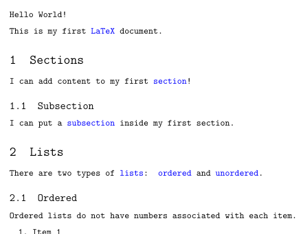
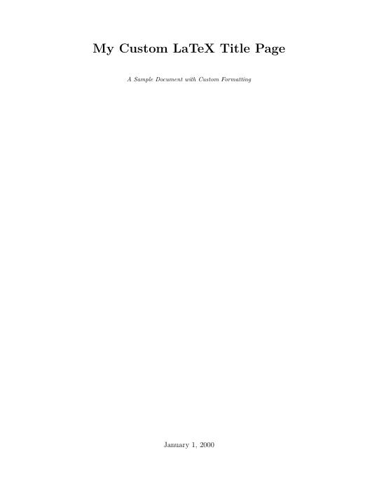

:::::::::::::::::::::::::::::::::::::: questions

- How can we set paragraph spacing in LaTeX?
- How can we customize text formatting in LaTeX?
- How can we align text in LaTeX?

::::::::::::::::::::::::::::::::::::::::::::::::

::::::::::::::::::::::::::::::::::::: objectives

- Add custom spacing between paragraphs in LaTeX.
- Create a title page with custom text formatting.

::::::::::::::::::::::::::::::::::::::::::::::::

## Fonts

We saw earlier that we can create commands of our own in LaTeX, but there is also a `renewcommand`
command that let's us change the definition of an existing command. This might be useful if you
want the definition of a command to change throughout the document, however there are also some
commands that are pre-defined that we can modify with this command.

For Example, we can change the font of the entire document by adding the following line to our
preamble:

```latex
% Change the font of the entire document to a monospace font
\renewcommand{\familydefault}{\ttdefault}
```

When you compile the document you should see that it has changed from this:

{alt="Our document with the default font"}

To this:

{alt="Our document with the default font changed to a monospace font"}

### More Fonts

Unfortunately, the default LaTeX installation does not come with many fonts. However, there are
additional packages that you can include if you are looking for a specific font. Let's try making
our document look like it's using the `Times New Roman` font. To do this, all we need to do is add
the following line to the preamble:

```latex
\usepackage{tgtermes}
```

::: callout

You can find a large selection of fonts at [The LaTeX Font Catalogue](https://www.tug.org/FontCatalogue/),
complete with examples of how to use them in your document.

:::

When you are using `lualatex` (or `xelatex`) for compiling you can easily use
all the fonts that are installed locally on your computer:

```latex
\usepackage{fontspec}

% Set the main (serif) font:
\setmainfont{Times New Roman}

% Set the sans-serif and monospace fonts too, if you like:
\setsansfont{Arial}
\setmonofont{Courier New}
```


## Paragraph Spacing

A common style in LaTeX is to have no indents for paragraphs, but to incorporate a blank line
between them. We can achieve this using the `parskip` package.

We're going to use another package here just to show off some commands without having to write a
lot of text: the `lipsum` package. This package provides the `\lipsum` command, which generates
"Lorem Ipsum" text.

```latex
\usepackage{lipsum}
```

::: callout

Lorem Ipsum is a common piece of placeholder text used in publishing and graphic design. It is
often used to demonstrate the visual form of a document without relying on meaningful content.

The text itself comes from the first-century BC work *De finibus bonorum et malorum* by Marcus
Tullius Cicero.

:::

In our document, we can now use a blank line to separate paragraphs:

```latex
\section{Formatting and Spacing}

% Generate some "Lorem Ipsum" text
% The parameters mean "include paragraphs 1 thru 2" from the "Lorem Ipsum" text
\lipsum[1-2]
```

Compile the document and take a look at our section. You should see that our first paragraph has no
indent, and there is no blank line between it and the following paragraph. The second paragraph
does have an indent. This is the default behavior in LaTeX.

Now let's add our package:

```latex
\usepackage[parfill]{parskip}
```

Keep an eye on the preview pane as you compile the document. You should see that the first
paragraph now has a blank line between it and the second paragraph, and there is no indent on the
first line of the second paragraph.


When you use a KOMA-Script documentclass you get the same result using a global
option:

```latex
\documentclass[parskip=full]{scrbook}
```

## Forcing a New Line

Most of the time, you should not force a new line in your document; you almost certainly want to
use a new paragraph or `parskip` instead. However, there are a *few* places where you might want
to force a new line:

- At the end of table rows
- Inside a `center` environment
- In poetry (the `verse` environment)

To force a new line, we can use the `\\` command.

## Adding Explicit Space

We can insert a thin space (about half the normal thickness) use the `\,` command.

::: callout

In math mode, there are also other commands:

- `\.` for a "dot" space
- `\:` for a "colon" space
- `\;` for a "thick" space
- `\!` for a "negative" space
- `\,` for a "thin" space

:::

Very rarely, for example when creating a title page, you might want to add explicit horizontal or
vertical space. We can do this using the `\hspace` and `\vspace` commands:

```latex
\hspace{1cm} % 1cm of horizontal space
\vspace{1cm} % 1cm of vertical space
```

We can also use the `\vfill` command to fill the remaining space on a page. This is useful for
centering content vertically on a page.

## Explicit Text Formatting

We've touched on this in previous episodes, but we can also use the following commands to format
text explicitly:

- `\textbf{}` for bold text
- `\textit{}` for italic text
- `\textrm{}` for roman text
- `\textsf{}` for sans serif text
- `\texttt{}` for typewriter text
- `\textsc{}` for small caps text

We can set the font size in the same way. All sizes are relative to the base font size:

- `\huge` for huge text
- `\large` for large text
- `\normalsize` for normal text
- `\small` for small text
- `\footnotesize` for footnote text


You can further customize your font size by setting the font size explicitly with the `\fontsize`
command. The first parameter is the font size, and the second parameter is the "leading", which is
the distance between the base lines of each line of text.

```
{\fontsize{14}{16}\selectfont \lipsum}
```

If you want it really big:

```latex
{\fontsize{10em}{4em}\selectfont This text is very heigh now with some leading.}
```


## Text Alignment

We can align text using the following commands:

- `\centering` to center text
- `\raggedright` to left-align text
- `\raggedleft` to right-align text


## Creating a Title Page

Using all of this, let's create a simple title page for our document. We'll put this just after
the `\begin{document}` command, and enclose everything in a `titlepage` environment:

```latex
\begin{titlepage}
    \centering

    \textbf{My Example Document}

    \vfill
    January 1, 2000
\end{titlepage}
```

::: callout

The `titlepage` environment is a special environment that LaTeX uses to create a title page. It
sets some simple formating rules, like removing multiple columns and resetting the page number.
It also prevents styling rules we add like `centering` from affecting the rest of the document.

:::


:::::::::::::::::::::::::::::::::::::::::::::::::::::::::::::::::::: instructor

Inline instructor notes can help inform instructors of timing challenges
associated with the lessons. They appear in the "Instructor View"

::::::::::::::::::::::::::::::::::::::::::::::::::::::::::::::::::::::::::::::::

## Challenges

::::::::::::::::::::::::::::::::::::: challenge

## Challenge 1: Create a Title Page with Custom Formatting

Using the content covered, create a title page with custom formatting. Your title page should have:

- A centered title "My Custom LaTeX Title Page" in large, bold text.
- A centered subtitle in italic text, smaller than the title.
- The date centered at the bottom of the page.

You can use the commands `\vspace` and `\vfill` to make fill blank space between the items.

Here's an example of what your title page could look like:

{alt="Example of a custom title page"}

::: hint

Use a `titlepage` environment to create the title page, and use the `\centering` command to center
center all of the text inside the environment.

```latex
\begin{titlepage}
  \centering

  % Title

  % Subtitle

  % Date

\end{titlepage}
```

:::

:::::::::::::::::::::::: solution

## Output

```latex
\begin{titlepage}
    \centering
    \huge
    \textbf{My Custom LaTeX Title Page}

    \vspace{1cm} % Space between title and subtitle
    \normalsize
    \textit{A Sample Document with Custom Formatting}

    \vfill % Fill remaining space
    \large
    January 1, 2025
\end{titlepage}
```

:::::::::::::::::::::::::::::::::
::::::::::::::::::::::::::::::::::::::::::::::::


::::::::::::::::::::::::::::::::::::: challenge

## Challenge 2: Adjust Paragraph Spacing

Consider the following document:

```latex
\documentclass{article}
\usepackage{lipsum}

\begin{document}

\section{My Report}

\lipsum[1]
\lipsum[2]
\lipsum[3]

\end{document}
```

We want our document to have no indents for paragraphs, but to have a single blank line between
them. What do we need to change in the document to achieve this?

:::::::::::::::::::::::: solution

We need to add the `parskip` package to the preamble of our document. This will add a blank line
between paragraphs and remove the indent from the first line of each paragraph.

We also need to add a blank line between each `\lipsum` command in order to create a new paragraph
for each block of text.

```latex
\documentclass{article}
\usepackage{lipsum}
\usepackage[parfill]{parskip}

\begin{document}

\section{My Report}

\lipsum[1]

\lipsum[2]

\lipsum[3]

\end{document}
```

:::::::::::::::::::::::::::::::::
::::::::::::::::::::::::::::::::::::::::::::::::

::::::::::::::::::::::::::::::::::::: challenge

## Challenge 3: Making a custom quote block

Create a customg quote block using a `center` environment and `\vspace` commands. See if you can
make it look something like this:

{alt="Example of a custom quote block"}

Note that there is some vertical space above and below the quote, and the text is formatted with
different font sizes and styles. The quote itself is in italics, and the attribution is in small
caps.

Bonus! Make a `\newcommand` to create a custom quote block that you can reuse throughout your
document.

::: hint

Use a `center` environment to center the text, and use `\vspace` to add space above and below the
quote. Format the text using explicit formatting options.

:::

:::::::::::::::::::::::: solution

```latex
\begin{center}
    \large\textbf{Words of Wisdom}

    \vspace{0.25cm}
    \small\textit{``Computers are good at following instructions, but not at reading your mind.''}

    \vspace{0.25cm}
    \textsc{--- Donald Knuth, 1986}
\end{center}
```

Bonus:

```latex
\newcommand{\customquote}[2]{
    \begin{center}
        \large\textbf{Words of Wisdom}

        \vspace{0.25cm}
        \small\textit{``#1''}

        \vspace{0.25cm}
        \textsc{--- #2}
    \end{center}
}

```

:::::::::::::::::::::::::::::::::
::::::::::::::::::::::::::::::::::::::::::::::::

::::::::::::::::::::::::::::::::::::: keypoints

- Use the `parskip` package to add space between paragraphs
- Force a new line with `\\`
- Add explicit space with `\hspace` and `\vspace`
- Format text explicitly with `\textbf`, `\textit`, etc.
- Align text with `\centering`, `\raggedright`, and `\raggedleft`

::::::::::::::::::::::::::::::::::::::::::::::::

