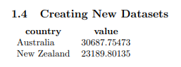

:::::::::::::::::::::::::::::::::::::: questions

- Why would I want to load data into my LaTeX document?
- How can I incorporate data analysis into my LaTeX document?

::::::::::::::::::::::::::::::::::::::::::::::::

::::::::::::::::::::::::::::::::::::: objectives

- Load a csv file into a LaTeX document and display it as a table
- Manipulate the data to get summary statistics in another table
- Create a simple plot using the data

::::::::::::::::::::::::::::::::::::::::::::::::

## Introduction

To start with we need to use the `datatool` package. We can find information about the package on
CTAN: [https://ctan.org/pkg/datatool](https://ctan.org/pkg/datatool), including a readme.

We can install the package using the following command in the terminal:

```bash
tlmgr install datatool
```

We can then load the package in our LaTeX document using the following command:

```latex
\usepackage{datatool}
```

We'll also need some data to work with. We'll use some simple CSVs that contain data about GDP
per capita and life expectancy from the past 50 years. You can download the data from
[here](/files/gapminder_data_tidy.zip). Unzip the file and place the contents in you project directory.

Your directory should look like this:

```
project/
├── data
│   ├── gapminder_tidy.csv
│   ├── gapminder_gdp_africa.csv
│   ├── gapminder_gdp_americas.csv
│   ├── gapminder_gdp_asia.csv
│   ├── gapminder_gdp_europe.csv
│   └── gapminder_gdp_oceania.csv
├── main.tex
├── other files...
```

## Loading Data

First things first, we want to load the data into our LaTeX document. We can do this with the
`\DTLread` command from the `datatool` package. This command takes two arguments: the name of the
database and the path to the CSV file.

```latex
\section{Loading and Manipulating Data}

We are using the datatool package to load and manipulate data in our LaTeX document.

\subsection{Loading Data}

We can \kw{load} the data from the CSV file with the \cmd{DTLread} command:

\DTLread[name=gapminder]{data/gapminder_tidy_oceania.csv}
```

You'll notice that loading the data doesn't display any output in the document. We need a seperate
command to show the data.

## Displaying Data

We can display the data in a table using the `\DTLdisplaydb` command. This command takes the name of
the database as an argument and displays the data in a table.

```latex
\subsection{Displaying Data}

\DTLdisplaydb{gapminder}
```

Your document should now look something like this:


We can see the data now, but we have way too much data to show in a single table. Let's filter
the data to only show the GDP per capita data.

## Filtering Data

We can filter the data by using the `\DTLforeach` command. This command iterates over all the rows
of our database and does something with each row (like a for loop in programming languages). We can
also add conditions to the first argument to filter the data. We can use `\DTLisieq` to check
if a value in the row is equal to a specific value.

Note that this command has a few more arguments than the previous one:

- The first argument is a list of conditions to filter the data.
- The second argument is the name of the database.
- The third argument is a list of variables to extract from the database.
  - Note that all variables you use in the `\DTLforeach` command must be identified here.
- The last argument is the code to execute for each row that matches the conditions.

```latex
\subsection{Filtering Data}

\DTLforeach[
  \DTLisieq{\year}{2002}
  \and
  \DTLisieq{\metric}{gdpPercap}
]{gapminder}{
  \country=country,
  \year=year,
  \metric=metric,
  \datavalue=value%
}{
  \country\,(\year): \datavalue\\
}
```

::: callout

You'll notice that the "value" variable is assigned to `\datavalue` and not `\value`. This is
because `\value` is a reserved command in LaTeX, so we need to use a different name for the
variable.

:::

Your filtered data should look something like this:


## Data Aggregation

A very common task in data analysis might be to aggregate the data and calculate some sort of
summary statistic. For this, `datatool` provides some usefule commands:

- `\DTLsumforkeys`
- `\DTLmaxforkeys`
- `\DTLmeanforkeys`
- `\DTLsdforkeys`

We can use these commands to calculate the sum, maximum, mean, and standard deviation of a variable
for a specific set of keys. The syntax is (Almost!) identical to the `\DTLforeach` command.

::: important

Note that compared to the `\DTLforeach` command, the second and third arguments are switched. In
this command, the second argument is the list of variables and the third argument is the database
name.

:::

```latex
\subsection{Data Aggregation}

\DTLmeanforkeys[
  \DTLisieq{\year}{2002}
  \and
  \DTLisieq{\metric}{gdpPercap}
]
[
  \year=year,
  \metric=metric
]{gapminder}{value}{\myresult}

Average GDP per capita in 2002: \myresult
```

## Creating New Datasets

The `\DTLforeach` command is extremely useful - say we want to create a new dataset to work with
that only contains the GDP per capita data for the year 2002 for our dataset. We could filter the
original dataset each time and then perform our analysis, but this could be inefficient and it
could be complicated.

Instead, let's use some new command to create a new dataset that only contains the data we want
to work with:

```latex
\subsection{Creating New Datasets}

\DTLnewdb{filteredgapminder}

\DTLforeach[
  \DTLisieq{\year}{2002}
  \and
  \DTLisieq{\metric}{gdpPercap}
]{gapminder}{
  \country=country,
  \year=year,
  \metric=metric,
  \datavalue=value
}{
  \DTLnewrow{filteredgapminder}
   \dtlexpandnewvalue% https://tex.stackexchange.com/a/375856/98739
  \DTLnewdbentry{filteredgapminder}{country}{\country}
  \DTLnewdbentry{filteredgapminder}{value}{\datavalue}
}
```

Some things to point out here:

- We first create a new database with the `\DTLnewdb` command. This creates a new database in
    memory we can add rows to later.
- We then use the `\DTLnewrow` command to create a new row in the database.
- We use the `\DTLnewdbentry` command to add a new entry to the row. The first argument is the
    name of the database, the second argument is the name of the column, and the third argument is
    the value to add to that column.

::: callout

We need to use the `\dtlexpandnewvalue` command WHY

:::

We can now display the new database using the `\DTLdisplaydb` command:

```latex
\DTLdisplaydb{filteredgapminder}
```

Your document should now look something like this:



## Plotting Data

Now that we have our filtered data, we can also plot it!. We'll need a new package for this called
`databar`, so add this to your preamble:

```latex
\usepackage{databar}
```

Now we can use the `\DTLBarChart` command to create a bar chart from our data:

```latex
\subsection{Plotting Data}

\DTLbarchart
{
  variable=\datavalue,
}{filteredgapminder}{
  \datavalue=value,
  \country=country
}
```

::: callout

If you get an error about `LaTeX Error: File `tikz.sty' not found.`, you'll need to install an
additional package. You can do this with the following command:

```bash
tlmgr install pgf
```

:::

Your document should now look something like this:


::::::::::::::::::::::::::::::::::::: challenge

## Challenge 1: Changing the Input Data

There are other data files in the `data` directory. Try switching out the
`gapminder_tidy_oceania.csv` file for one of the other files and see if this code still works.

Did you notice anything different? If so, what was it?

:::::::::::::::::::::::: solution

## Output

If you used one of the other files, you might have noticed that the time it took create the pdf
was much longer. This is because the other files contain more data than the
`gapminder_tidy_oceania.csv` file. The `datatool` package can handle large datasets, but it
can take a long time to process them.

You might consider pre-processing the data in another language (like R or Python) and
then loading the processed data into your LaTeX document.

:::::::::::::::::::::::::::::::::


## Challenge 2: Diplaying the results in a table

In the "Data Filtering" section above, we displayed the filtered data using the `\DTLforeach`
command like this:

```latex
\DTLforeach[
  \DTLisieq{\year}{2002}
  \and
  \DTLisieq{\metric}{gdpPercap}
]{gapminder}{
  \country=country,
  \year=year,
  \metric=metric,
  \datavalue=value%
}{
  \country\,(\year): \datavalue\\
}
```

How might you display the results in a table? See if you can get the output to look like this:


Refer back to the [Episode on Tables](/08-tables.md) to review the
syntax for creating tables in LaTeX.

NOTE: There is an issue with `datatool` and `/bottomrule` in tables - for now, skip the
`bottomrule` command in your table. (You'll get an error about "misplaced \noalign".)

:::::::::::::::::::::::: solution

```
\begin{tabular}{rlr}
\toprule
\textbf{Country} & \textbf{Year} & \textbf{GDP per Capita} \\
\midrule
\DTLforeach[
  \DTLisieq{\year}{2002}
  \and
  \DTLisieq{\metric}{gdpPercap}
]{gapminder}{
  \country=country,
  \year=year,
  \metric=metric,
  \datavalue=value%
}{
  \country & \year & \datavalue\\
}%
\end{tabular}
```

:::::::::::::::::::::::::::::::::
::::::::::::::::::::::::::::::::::::::::::::::::


::::::::::::::::::::::::::::::::::::: keypoints

- The `datatool` package allows us to load and manipulate data in LaTeX documents.
- We can load data from a CSV file using the `\DTLread` command.
- We can display data in a table using the `\DTLdisplaydb` command.
- We can filter data using the `\DTLforeach` command and conditions.
- We can aggregate data using commands like `\DTLmeanforkeys`, `\DTLsumforkeys`, etc.

::::::::::::::::::::::::::::::::::::::::::::::::

