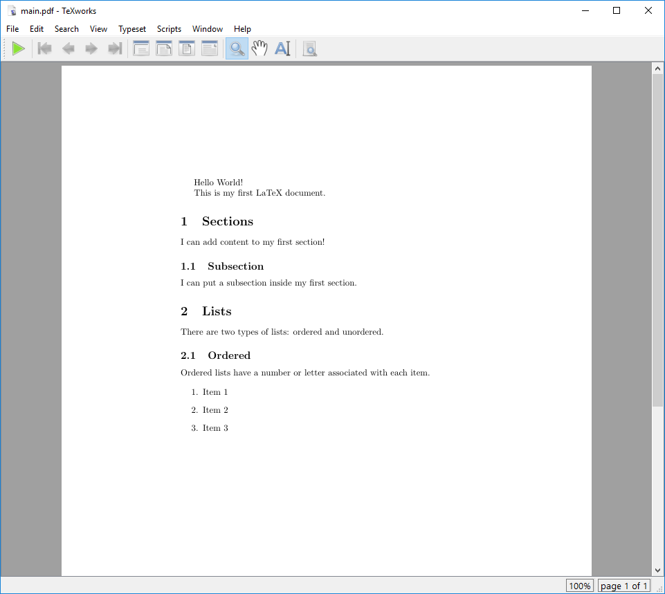
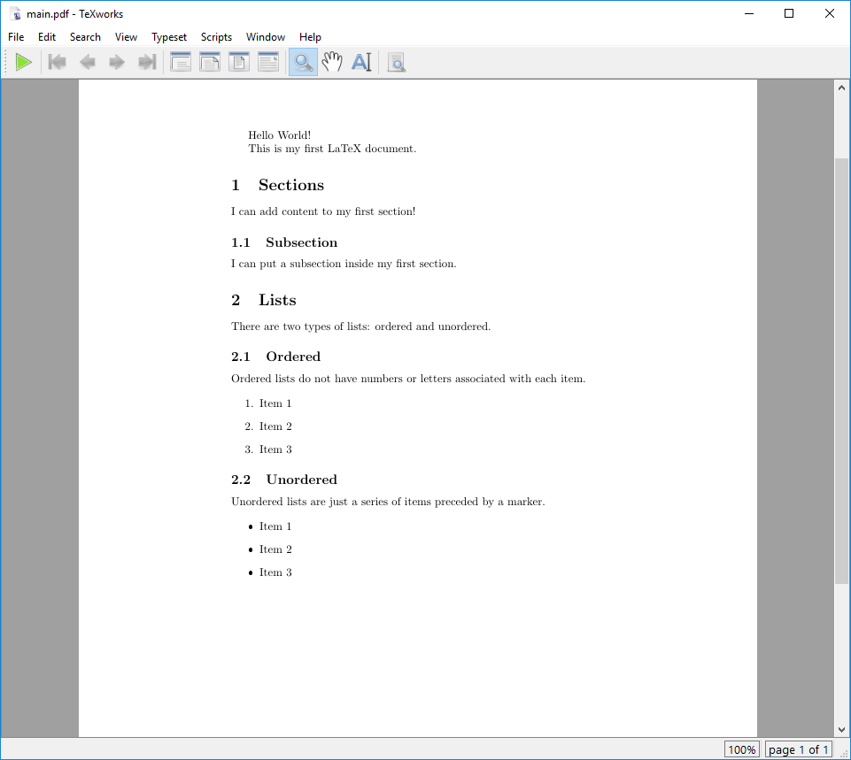

:::::::::::::::::::::::::::::::::::::: questions

- How can I create a list in LaTeX?
- What are some variations of lists I can use?

::::::::::::::::::::::::::::::::::::::::::::::::

::::::::::::::::::::::::::::::::::::: objectives

- Create a list within a LaTeX document.
- Customize the appearance of a list in LaTeX.

::::::::::::::::::::::::::::::::::::::::::::::::

## Lists

In LaTeX, as in markdown, there are two types of lists: ordered and unordered. They are both
defined with `\begin{...}` and `\end{...}` commands, as we saw with the document body. Let's add
an ordered list to our document.

We'll replace our "Second Section" with one for "Lists" and add an ordered list:

```latex
% This command tells LaTeX what kind of document we are creating (article).
\documentclass{article}


% Everything before the \begin{document} command is called the preamble.
\begin{document} % The document body starts here

\tableofcontents

% The section command automatically numbers and formats the section heading.
\section{Sections}

Hello World!

This is my first LaTeX document.

I can add content to my first section!

% The subsection command does the same thing, but for sections within sections.
\subsection{Subsection}

I can put a subsection inside my first section.

\section{Lists}

There are two types of lists: ordered and unordered.

\subsection{Ordered}

Ordered lists have a number or letter associated with each item.

\begin{enumerate}
  \item Item 1
  \item Item 2
  \item Item 3
\end{enumerate}

\end{document}
```

When you compile this document, you should see something like this in the preview pane:

{alt='Our document with an enumerated list.'}

::: callout

Note that the `\item` commands do not need to be enclosed in braces. These commands do not take
any arguments, so they can be used as standalone commands. The text that follows the `\item`
command will be treated as the content of the list item. However, you are able to specify your own
bullet point symbols with `\item[]` manually. For instance, if you want a list with small letters in brackets
you can use the following LaTeX code:

```latex
% This command tells LaTeX what kind of document we are creating (article).
\documentclass{article}


% Everything before the \begin{document} command is called the preamble.
\begin{document} % The document body starts here

% List with custom bullet point symbols
\begin{itemize}
  \item[(a)] Item 1
  \item[(b)] Item 2
  \item[(c)] Item 3
\end{itemize}

\end{document}
```

:::

::: callout

It's also possible to create a list with roman numerals automatically with the `enumitem` package:
```latex
\documentclass{article}
\usepackage{enumitem} %<-- package for lists https://texdoc.org/serve/enumitem/
% \setlist{label=\Roman*} %<-- globally defining the enumeration system
\begin{document}
\begin{enumerate}[
  label=\emph{\roman*}, %<-- change labeling system locally (or \Roman)
  leftmargin=5cm, %<-- change indent on the left
]
  \item First
  \item Second
  \item Third
  \item Fourth
\end{enumerate}
\end{document}
```

:::

Adding an unordered list is just as easy. We can use the exact same syntax, but replace the
`enumerate` environment with `itemize`.

```latex
% This command tells LaTeX what kind of document we are creating (article).
\documentclass{article}


% Everything before the \begin{document} command is called the preamble.
\begin{document} % The document body starts here

\tableofcontents

% The section command automatically numbers and formats the section heading.
\section{Sections}

Hello World!

This is my first LaTeX document.

I can add content to my first section!

% The subsection command does the same thing, but for sections within sections.
\subsection{Subsection}

I can put a subsection inside my first section.

\section{Lists}

There are two types of lists: ordered and unordered.

\subsection{Ordered}

Ordered lists do not have numbers or letters associated with each item.

\begin{enumerate}
  \item Item 1
  \item Item 2
  \item Item 3
\end{enumerate}

\subsection{Unordered}

Unordered lists are just a series of items preceded by a marker.

\begin{itemize}
  \item Item 1
  \item Item 2
  \item Item 3
\end{itemize}

\end{document}
```

{alt='Our document with an unordered list.'}

::::::::::::::::::::::::::::::::::::: challenge

## Challenge 1: What needs to change?

We have the following in our LaTeX document:

```latex
\documentclass{article}

\begin{document}

\begin{enumerate}
  \item Banana Bread
  \item Carrot Muffins
  \item Apple Cake
\end{enumerate}

\end{document}
```

How would we modify this to change this ordered list to an unordered list?

:::::::::::::::::::::::: solution

## Answer

You would need to change the `enumerate` environment to `itemize`:

```latex
\documentclass{article}

\begin{document}

\begin{itemize}
  \item Banana Bread
  \item Carrot Muffins
  \item Apple Cake
\end{itemize}

\end{document}
```

:::::::::::::::::::::::::::::::::
::::::::::::::::::::::::::::::::::::::::::::::::

::::::::::::::::::::::::::::::::::::: challenge

## Challenge 2: Can you do it?

We would like to have the following appear in our LaTeX document:

- Apples
  1. Gala
  2. Fuji
  3. Granny Smith
- Bananas
- Oranges

How would you write this in LaTeX?

:::::::::::::::::::::::: solution

## Answer

```latex
\documentclass{article}

\begin{document}

\begin{itemize}
  \item Apples
  \begin{enumerate}
    \item Gala
    \item Fuji
    \item Granny Smith
  \end{enumerate}
  \item Bananas
  \item Oranges
\end{itemize}

\end{document}
```

:::::::::::::::::::::::::::::::::
::::::::::::::::::::::::::::::::::::::::::::::::

::::::::::::::::::::::::::::::::::::: challenge


## Challenge 3: Enumerate your list manually

We would like to have the following appear in our LaTeX document:


1. Gala
2. Fuji
3. Granny Smith


How would you write this in LaTeX **without** using `enumerate` but `itemize` with `\item[]`?

:::::::::::::::::::::::: solution

## Answer

```latex
\documentclass{article}

\begin{document}

\begin{itemize}
  \item[1.] Gala
  \item[2.] Fuji
  \item[3.] Granny Smith
\end{itemize}

\end{document}
```

:::::::::::::::::::::::::::::::::
::::::::::::::::::::::::::::::::::::::::::::::::

::::::::::::::::::::::::::::::::::::: keypoints

- Lists in LaTeX are created using the `enumerate` and `itemize` environments.

::::::::::::::::::::::::::::::::::::::::::::::::

