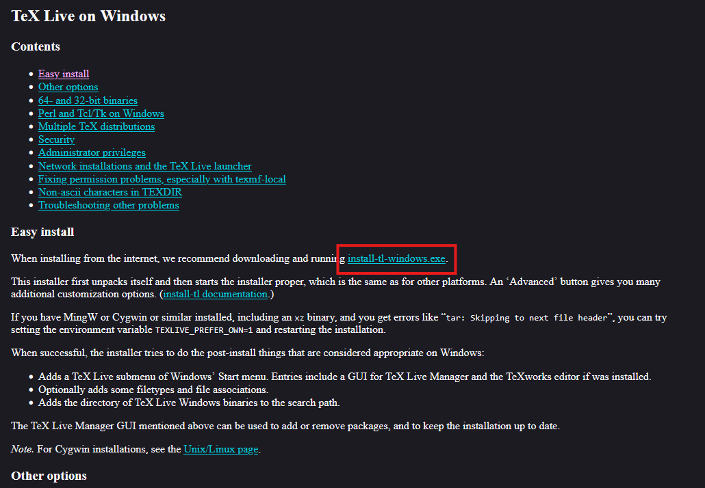
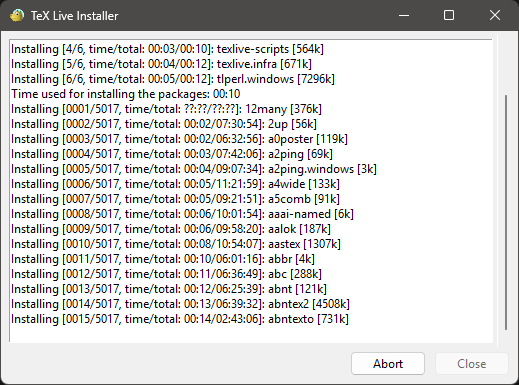
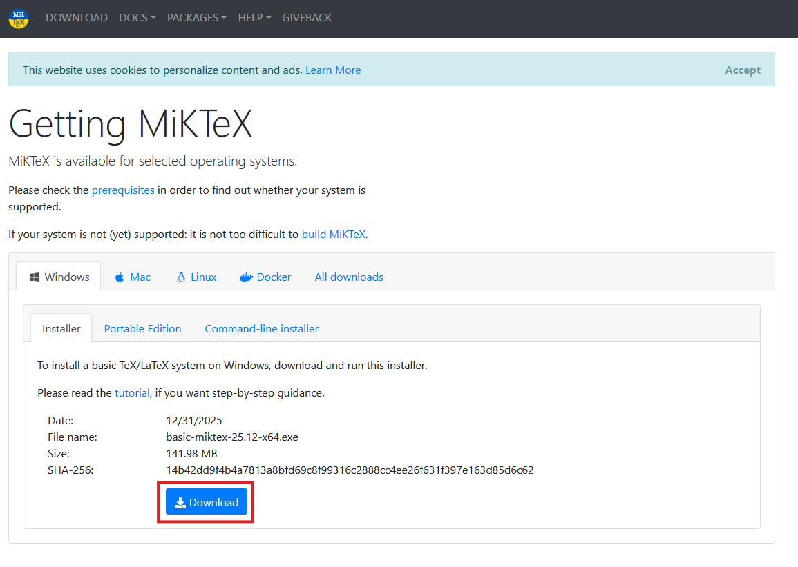
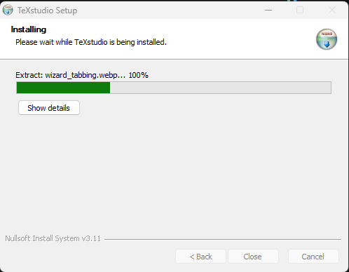
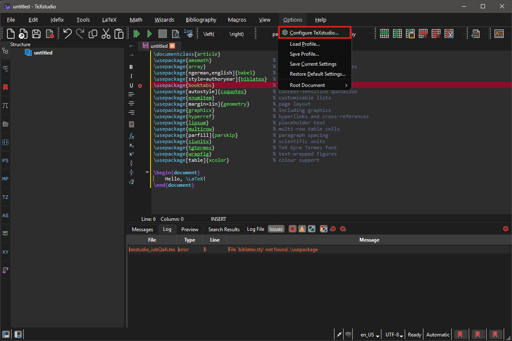
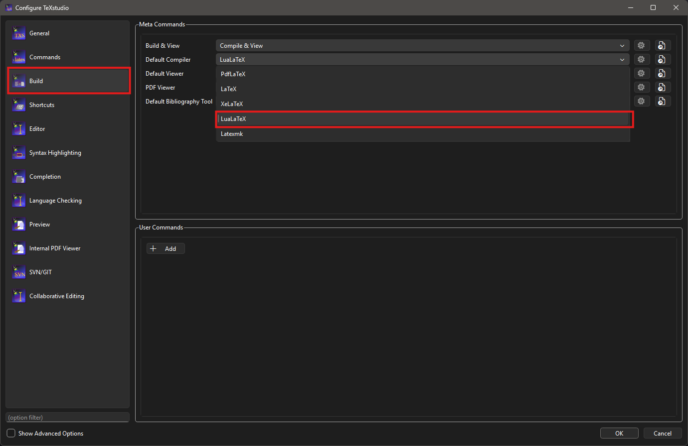

This workshop will be demonstrated using [TeXStudio](https://www.texstudio.org/) to write and
render LaTeX documents. TeXStudio is a feature-rich, integrated LaTeX writing environment with
syntax highlighting, an integrated PDF viewer, and inline error checking. It is available for
Windows, macOS, and Linux.

Because TeXStudio is an *editor*, it needs a separate LaTeX *distribution* to compile documents.
The distribution provides the compilers and various packages which we will use throughout this
workshop.

## Software Setup

You can find installation instructions for TeXStudio on the TeXStudio website
(https://www.texstudio.org/). We include a brief overview of the installation process on this page
for convenience, but we recommend that you refer to the official documentation for the most
up-to-date instructions, and defer to the official documentation if you encounter any issues
during installation.

## Windows Installation

Windows users need to install two pieces of software: a LaTeX distribution and TeXStudio.

### Step 1 — Install a LaTeX Distribution

A LaTeX distribution provides the compilers and packages needed to build your documents. Two
popular options are TeX Live and MiKTeX. You are welcome to choose either distribution, but our
demonstration will use TeX Live.

::: tab

### TeX Live

Visit the TeX Live website (https://www.tug.org/texlive/windows.html) and download the
"install-tl-windows.exe" installer.

{alt="The TeX Live website download page showing the link to install-tl-windows.exe"}

Run the installer. When the dialog appears, select "Install" and click "Next".

Click "Install" to begin the installation process. This will unpack some files before opening a
new window called the "TeX Live Installer".

{alt="The TeX Live Installer window showing progress"}

*If desired, you can change the installation directory by clicking on the "Change" button.*

Note that the full TeX Live installation is large (over 5 GB) and may take some time to download
and install, depending on your internet connection and computer speed.

When the installation is complete, you can close the installer windows.

### MiKTeX

Visit the MiKTeX website (https://miktex.org/download) and download the Windows installer.

{alt="The MiKTeX download page showing the Windows installer option"}

Run the installer and follow the prompts. Installing for all users (rather than just the current
user) is recommended if you have administrator rights on your machine. Keep the remaining default
options.

When the installation is complete, you can close the installer.

:::

### Step 2 — Install TeXStudio

Visit the TeXStudio website (!!!  link to the TeXStudio download page) to download the latest
installer for Windows. For most machines, download the 64-bit Windows installer (`x86_64`).

{alt="The TeXStudio download page showing the Windows installer options"}

Run the downloaded `.exe` file. Click "Next" through the prompts, then click "Install". When the
installation is complete, click "Finish".

{alt="The TeXStudio installer on Windows showing the installation progress"}

## macOS Installation

macOS users need to install two pieces of software: MacTeX (the LaTeX distribution) and
TeXStudio.

### Step 1 — Install MacTeX

Visit the MacTeX download page (!!!  link to the MacTeX download page at tug.org/mactex) and
download the "MacTeX.pkg" file.

{alt="The MacTeX download page showing the MacTeX.pkg download link"}

Double-click the downloaded "MacTeX.pkg" file to start the installation process. Follow the
prompts to complete the installation. The default installation options are recommended for most
users.

{alt="The MacTeX installer on macOS showing the default installation options"}

### Step 2 — Install TeXStudioa

Visit the TeXStudio download page (!!!  link to the TeXStudio download page) and download the
macOS version. Two builds are available: one for Intel Macs and one for Apple Silicon (M1/M2/M3)
Macs. Download the version that matches your hardware.

{alt="The TeXStudio download page showing the macOS zip file options for Intel and Apple Silicon"}

Unzip the downloaded file and drag the TeXStudio application into your "Applications" folder.

**Note:** Because TeXStudio is distributed without an Apple Developer signature, macOS may
display a warning that it cannot verify the developer. If this happens, do not double-click the
icon. Instead, hold **Control**, click the TeXStudio icon, and select "Open" from the
context menu. A dialog will appear asking you to confirm that you want to open the application;
click "Open".

{alt="The macOS security dialog warning about an unidentified developer, with the Open button highlighted"}

## Unix/Linux Installation

Linux users need to install two pieces of software: TeX Live (the LaTeX distribution) and
TeXStudio.

### Step 1 — Install TeX Live

Install TeX Live using your distribution's package manager. The `texlive-full` package is
recommended for this workshop, as it includes all of the packages used in the exercises.

**Debian/Ubuntu:**

```bash
sudo apt update
sudo apt install texlive-full
```

**Fedora/RHEL:**

```bash
sudo dnf install texlive-scheme-full
```

Note that the full TeX Live installation is large and the download may take some time.

### Step 2 — Install TeXStudio

::: tab

### Package Manager (Recommended)

TeXStudio is available in the package repositories for most major Linux distributions. Install it
using your package manager:

```bash
sudo apt install texstudio
```

### AppImage

NOTE: Need someone to verify these instructions.

If you prefer not to use your package manager, a self-contained AppImage is available from the
TeXStudio GitHub releases page.

Download the file ending in `-x86_64.AppImage`. Then open a terminal in the directory where you
saved it and run:

```bash
chmod +x texstudio-*-x86_64.AppImage
./texstudio-*-x86_64.AppImage
```

:::

## Configure the Default Compiler

TeXStudio defaults to pdfLaTeX as its compiler. This workshop uses **LuaLaTeX**, which supports
modern font handling (including the `fontspec` package) and is required for some exercises. You
should change the default compiler before you begin.

Open TeXStudio and go to **Options** > **Configure TeXstudio…** (on macOS: **TeXstudio** >
**Preferences…**).

{alt="The TeXStudio menu bar with Options highlighted and Configure TeXstudio selected from the drop-down"}

In the configuration dialog, select **Build** from the left-hand panel. Under **Default Compiler**,
open the drop-down menu and select **LuaLaTeX**.

{alt="The TeXStudio Build configuration panel showing the Default Compiler drop-down set to LuaLaTeX"}

Click **OK** to save the change.

## Verify Installation

Open TeXStudio. You should see the main editor window with an empty document area.

{alt="The TeXStudio main window showing the editor panel, structure panel on the left, and messages panel at the bottom"}

Create a new file by selecting "File" > "New" (or pressing `Ctrl+N`) and paste the following
code into the editor. This document loads all of the packages used throughout the workshop, so
compiling it successfully confirms that your installation is complete.

```latex
\documentclass{article}
\usepackage{amsmath}                     % mathematics formatting
\usepackage{array}                       % extended table column types
\usepackage[ngerman,english]{babel}      % multilingual support
\usepackage[style=authoryear]{biblatex}  % bibliography management
\usepackage{booktabs}                    % professional table rules
\usepackage[autostyle]{csquotes}         % context-sensitive quotation
\usepackage{enumitem}                    % customisable lists
\usepackage[margin=1in]{geometry}        % page layout
\usepackage{graphicx}                    % including graphics
\usepackage{hyperref}                    % hyperlinks and cross-references
\usepackage{lipsum}                      % placeholder text
\usepackage{multirow}                    % multi-row table cells
\usepackage[parfill]{parskip}            % paragraph spacing
\usepackage{siunitx}                     % scientific units
\usepackage{tgtermes}                    % TeX Gyre Termes font
\usepackage{wrapfig}                     % text-wrapped figures
\usepackage[table]{xcolor}               % colour support

\begin{document}
Hello, \LaTeX!
\end{document}
```

Press **F6** (or select "Tools" > "Build & View") to compile the document. TeXStudio will run
the LaTeX compiler and, if successful, display the resulting PDF in the panel to the right of the
editor.

{alt="The TeXStudio editor with the Hello LaTeX code on the left and the compiled PDF showing 'Hello, LaTeX!' on the right"}

If you see the text "Hello, LaTeX!" in the PDF panel, your installation is working correctly.

### Troubleshooting

If you encounter an error during compilation like
"texstudio_iubQaA.tex: error: 6: File `biblatex.sty' not found. \usepackage`", this indicates that
you are missing some of the required LaTeX packages and will need to install them in your
distribution. This will depend on the distribution you chose earlier.

::: tab

### TeX Live

If you installed TeX Live using the full installation option, you should have all of the
required packages. If you chose a custom installation, you may need to install additional packages
using the TeX Live Manager. Open the TeX Live Manager application and search for the missing
package (for example, "biblatex"). Select the package from the search results and click "Install"
to add it to your distribution.

You may also install missing packages using the command line. Open a terminal and run the following
command, replacing `<package-name>` with the name of the missing package:

```bash
tlmgr install <package-name>
```

### MiKTeX

TODO: Add instructions for installing missing packages in MiKTeX.

:::

## Backup Option: Overleaf

If you are unable to install software on your device (for example, because it is a
managed or corporate machine), you can use **Overleaf** as a browser-based alternative.
Overleaf is a free, online LaTeX editor — no installation is required, and it works in any
modern web browser.

::::::::::::::::::::::::::::::::::::::::: callout

### Using Overleaf Instead of a Local Installation

Please note that local installation of TeXStudio is strongly preferred for this workshop, as some
exercises may rely on features or file access that are not available in the browser-based
environment. Use Overleaf only if you cannot install software on your machine.

::::::::::::::::::::::::::::::::::::::::::::::::
